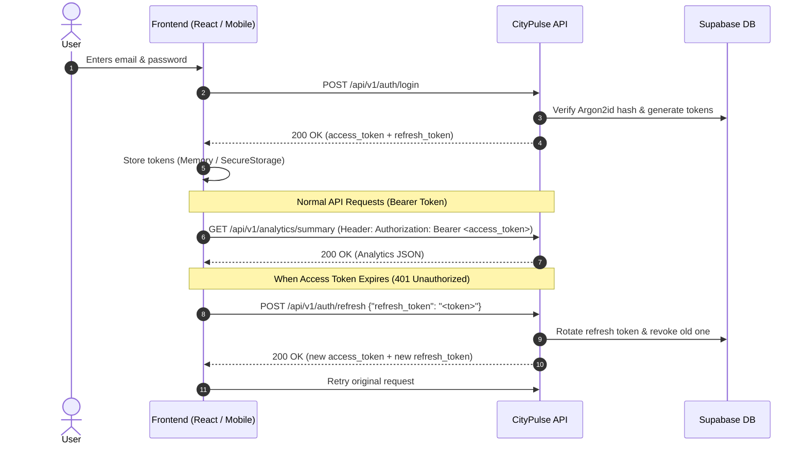

# 📱 Frontend & Mobile Developer Integration Guide

Welcome to the **CityPulse API** developer integration guide! This guide explains everything a **Frontend (React, Next.js, Vue)** or **Mobile (React Native, Flutter, Swift, Kotlin)** developer needs to connect, test with **Swagger / Postman**, and render live mobility analytics, saved locations, and trip histories in their UI.

---

## 📑 Table of Contents

1. [Quick Overview & Live Base URLs](#-quick-overview--live-base-urls)
2. [Testing with Swagger UI (Interactive)](#-testing-with-swagger-ui-interactive)
3. [Testing with Postman (1-Click Import)](#-testing-with-postman-1-click-import)
4. [Demo Accounts & Test Credentials](#-demo-accounts--test-credentials)
5. [Authentication & Token Lifecycle](#-authentication--token-lifecycle)
6. [Core API Endpoints & UI Use-Cases](#-core-api-endpoints--ui-use-cases)
7. [Full React / TypeScript Integration Example](#-full-react--typescript-integration-example)
8. [Mobile Integration Example (React Native / Flutter)](#-mobile-integration-example-react-native--flutter)
9. [Error Handling & Interceptor Best Practices](#-error-handling--interceptor-best-practices)
10. [Dedicated Module Guides (Auth, Trips, Locations, Analytics)](#-dedicated-module-deep-dives)

---

### 📦 Dedicated Module Deep Dives
For granular TypeScript models, full UI components, and field validations by domain:
- 🔐 **[AUTH_MODULE.md](docs/modules/AUTH_MODULE.md)**: Argon2id auth, rotating JWTs, user profile management.
- 🚗 **[TRIPS_MODULE.md](docs/modules/TRIPS_MODULE.md)**: Mobility tracking, transport mode filters, journey logging UI.
- 📍 **[LOCATIONS_MODULE.md](docs/modules/LOCATIONS_MODULE.md)**: Saved places, WGS84 paired coordinates, map pin selector.
- 📊 **[ANALYTICS_MODULE.md](docs/modules/ANALYTICS_MODULE.md)**: KPIs, modal split charts, daily distance trends, outlier alerts.
- 🌐 **[Master Index](docs/modules/README.md)**: Architecture overview & universal pagination envelope.

---

## 🌐 Quick Overview & Live Base URLs

| Environment | Base URL | OpenAPI Specification |
| :--- | :--- | :--- |
| **Production (Render)** | `https://citypulse-api-tjpr.onrender.com` | `https://citypulse-api-tjpr.onrender.com/api/v1/openapi.json` |
| **Local Development** | `http://127.0.0.1:8000` | `http://127.0.0.1:8000/api/v1/openapi.json` |

> 🔒 **CORS Policy**: The production server accepts requests from all origins (`*`) with standard headers (`Authorization`, `Content-Type`). You do not need to configure backend CORS proxies for web apps.

---

## 🧪 Testing with Swagger UI (Interactive)

Swagger UI allows you to test every endpoint directly in your browser without writing any code.

### Step-by-Step Swagger Testing:
1. Open **[https://citypulse-api-tjpr.onrender.com/api/v1/docs](https://citypulse-api-tjpr.onrender.com/api/v1/docs)**.
2. Scroll to **`POST /api/v1/auth/login`**:
   - Click **Try it out**.
   - Paste the test credentials:
     ```json
     {
       "email": "alice_urban@example.com",
       "password": "StrongPassword!2026"
     }
     ```
   - Click **Execute**.
   - Copy the `access_token` from the JSON response.
3. Scroll to the top of the Swagger page and click the green **`Authorize 🔓`** button:
   - Paste the token into the `Value` box (or enter `Bearer <your_token>`).
   - Click **Authorize** $\rightarrow$ **Close**.
4. Now you can test any protected endpoint (e.g. `GET /api/v1/analytics/summary`, `GET /api/v1/locations`, `GET /api/v1/trips`) by clicking **Try it out** $\rightarrow$ **Execute**!

---

## 📬 Testing with Postman (1-Click Import)

You can import all 20+ endpoints and schemas into Postman in seconds:

1. Open **Postman** $\rightarrow$ Click **Import** (top-left).
2. Paste the OpenAPI URL:
   ```text
   https://citypulse-api-tjpr.onrender.com/api/v1/openapi.json
   ```
3. Click **Import**. Postman will generate a complete Collection named **CityPulse API**.
4. In your Postman Collection Settings:
   - Under **Variables**, set `baseUrl` = `https://citypulse-api-tjpr.onrender.com`.
   - Send `POST {{baseUrl}}/api/v1/auth/login` to obtain your token.
   - Under **Authorization**, select **Bearer Token** and use `{{accessToken}}`.

---

## 🔑 Demo Accounts & Test Credentials

The database contains pre-populated mobility data (trips, costs, coordinates, transport modes):

| Account | Email | Password | Pre-Loaded Sample Data |
| :--- | :--- | :--- | :--- |
| **Alice Urban** | `alice_urban@example.com` | `StrongPassword!2026` | 26 Trips, 7 Saved Locations (Home, Work, Gym, Cafe) |
| **Bob Commuter** | `bob_commuter@example.com` | `StrongPassword!2026` | 28 Trips, 6 Saved Locations (Metro, Office, Suburbs) |
| **Carol Cyclist** | `carol_cyclist@example.com` | `StrongPassword!2026` | 24 Trips, 5 Saved Locations (Bike trails, Parks) |

---

## 🔐 Authentication & Token Lifecycle

CityPulse uses **short-lived JWT Access Tokens (15 min)** and **single-use Rotating Refresh Tokens (7 days)**.



---

## 📊 Core API Endpoints & UI Use-Cases

### 1. Dashboard Summary Cards
* **Endpoint**: `GET /api/v1/analytics/summary`
* **Headers**: `Authorization: Bearer <access_token>`
* **Sample Response**:
  ```json
  {
    "from_date": "2026-07-15",
    "to_date": "2026-08-13",
    "trip_count": 13,
    "total_distance_km": "118.68",
    "total_cost": "1517.70",
    "total_duration_minutes": 416,
    "average_distance_km": "9.13"
  }
  ```
* **UI Use-Case**: Render 4 metric cards:
  - 🚗 **Total Trips**: `13`
  - 📏 **Distance Covered**: `118.68 km`
  - 💰 **Total Spent**: `₹1,517.70`
  - ⏱️ **Time in Transit**: `6h 56m`

---

### 2. Modal Split (Pie / Donut / Bar Chart)
* **Endpoint**: `GET /api/v1/analytics/transport-modes`
* **Sample Response**:
  ```json
  [
    {"transport_mode": "METRO", "trip_count": 5, "total_distance_km": "48.20", "total_cost": "240.00"},
    {"transport_mode": "CAB", "trip_count": 3, "total_distance_km": "32.10", "total_cost": "890.00"},
    {"transport_mode": "BIKE", "trip_count": 4, "total_distance_km": "22.50", "total_cost": "0.00"},
    {"transport_mode": "WALK", "trip_count": 1, "total_distance_km": "1.80", "total_cost": "0.00"}
  ]
  ```
* **UI Use-Case**: Feed directly into Chart.js, Recharts, or Victory Native.

---

### 3. Interactive Map Pins (Saved Locations)
* **Endpoint**: `GET /api/v1/locations`
* **Sample Response**:
  ```json
  [
    {
      "id": "loc-uuid-1",
      "name": "Central Tech Park",
      "category": "WORK",
      "latitude": 12.971598,
      "longitude": 77.594562,
      "notes": "Main office building 4"
    },
    {
      "id": "loc-uuid-2",
      "name": "Greenwood Residence",
      "category": "HOME",
      "latitude": 12.935242,
      "longitude": 77.624461,
      "notes": "Home apartment"
    }
  ]
  ```
* **UI Use-Case**: Place custom pins on Google Maps, Mapbox, or Leaflet.

---

### 4. Paginated Trips Feed / Data Table
* **Endpoint**: `GET /api/v1/trips?limit=10&offset=0`
* **Sample Response**:
  ```json
  [
    {
      "id": "trip-uuid-1",
      "transport_mode": "METRO",
      "started_at": "2026-08-13T08:30:00Z",
      "ended_at": "2026-08-13T09:15:00Z",
      "distance_km": "14.20",
      "cost": "45.00",
      "rating": 5,
      "purpose": "Morning Commute",
      "origin_location_id": "loc-uuid-2",
      "destination_location_id": "loc-uuid-1"
    }
  ]
  ```

---

## 💻 Full React / TypeScript Integration Example

Below is a complete, production-ready React client with Axios token interceptors and UI components:

### 1. API Client (`src/api/client.ts`)
```typescript
import axios from 'axios';

const BASE_URL = 'https://citypulse-api-tjpr.onrender.com/api/v1';

export const apiClient = axios.create({
  baseURL: BASE_URL,
  headers: { 'Content-Type': 'application/json' },
});

// Attach access token to outgoing requests
apiClient.interceptors.request.use((config) => {
  const token = localStorage.getItem('access_token');
  if (token && config.headers) {
    config.headers.Authorization = `Bearer ${token}`;
  }
  return config;
});

// Auto-refresh token on 401 Unauthorized
apiClient.interceptors.response.use(
  (response) => response,
  async (error) => {
    const originalRequest = error.config;
    if (error.response?.status === 401 && !originalRequest._retry) {
      originalRequest._retry = true;
      const refreshToken = localStorage.getItem('refresh_token');
      if (refreshToken) {
        try {
          const res = await axios.post(`${BASE_URL}/auth/refresh`, {
            refresh_token: refreshToken,
          });
          localStorage.setItem('access_token', res.data.access_token);
          localStorage.setItem('refresh_token', res.data.refresh_token);
          originalRequest.headers.Authorization = `Bearer ${res.data.access_token}`;
          return apiClient(originalRequest);
        } catch {
          // Token expired completely: log out user
          localStorage.removeItem('access_token');
          localStorage.removeItem('refresh_token');
          window.location.href = '/login';
        }
      }
    }
    return Promise.reject(error);
  }
);
```

---

### 2. Analytics Dashboard Component (`src/components/Dashboard.tsx`)
```tsx
import React, { useEffect, useState } from 'react';
import { apiClient } from '../api/client';

interface AnalyticsSummary {
  trip_count: number;
  total_distance_km: string;
  total_cost: string;
  total_duration_minutes: number;
  average_distance_km: string;
}

interface LocationItem {
  id: string;
  name: string;
  category: string;
  latitude: number;
  longitude: number;
}

export const Dashboard: React.FC = () => {
  const [summary, setSummary] = useState<AnalyticsSummary | null>(null);
  const [locations, setLocations] = useState<LocationItem[]>([]);
  const [loading, setLoading] = useState(true);

  useEffect(() => {
    async function fetchData() {
      try {
        const [summaryRes, locationsRes] = await Promise.all([
          apiClient.get<AnalyticsSummary>('/analytics/summary'),
          apiClient.get<LocationItem[]>('/locations'),
        ]);
        setSummary(summaryRes.data);
        setLocations(locationsRes.data);
      } catch (err) {
        console.error('Failed to load dashboard data:', err);
      } finally {
        setLoading(false);
      }
    }
    fetchData();
  }, []);

  if (loading) return <div>Loading mobility analytics...</div>;

  return (
    <div style={{ padding: '24px', fontFamily: 'sans-serif' }}>
      <h1>🏙️ CityPulse Mobility Overview</h1>

      {/* KPI Cards Grid */}
      {summary && (
        <div style={{ display: 'grid', gridTemplateColumns: 'repeat(4, 1fr)', gap: '16px', marginBottom: '32px' }}>
          <div style={cardStyle}>
            <h3>Total Trips</h3>
            <p style={kpiStyle}>{summary.trip_count}</p>
          </div>
          <div style={cardStyle}>
            <h3>Total Distance</h3>
            <p style={kpiStyle}>{summary.total_distance_km} km</p>
          </div>
          <div style={cardStyle}>
            <h3>Total Spent</h3>
            <p style={kpiStyle}>₹{summary.total_cost}</p>
          </div>
          <div style={cardStyle}>
            <h3>Avg Trip Distance</h3>
            <p style={kpiStyle}>{summary.average_distance_km} km</p>
          </div>
        </div>
      )}

      {/* Saved Locations List */}
      <h2>📍 Saved Locations ({locations.length})</h2>
      <ul>
        {locations.map((loc) => (
          <li key={loc.id}>
            <strong>{loc.name}</strong> ({loc.category}) — [{loc.latitude}, {loc.longitude}]
          </li>
        ))}
      </ul>
    </div>
  );
};

const cardStyle: React.CSSProperties = {
  border: '1px solid #e2e8f0',
  borderRadius: '8px',
  padding: '16px',
  backgroundColor: '#f8fafc',
};

const kpiStyle: React.CSSProperties = {
  fontSize: '28px',
  fontWeight: 'bold',
  color: '#0f172a',
  margin: '8px 0 0 0',
};
```

---

## 📱 Mobile Integration Example (React Native / Flutter)

### React Native (`fetch` + `expo-secure-store`)
```typescript
import * as SecureStore from 'expo-secure-store';

const API_BASE = 'https://citypulse-api-tjpr.onrender.com/api/v1';

export async function loginUser(email: string, password: string) {
  const response = await fetch(`${API_BASE}/auth/login`, {
    method: 'POST',
    headers: { 'Content-Type': 'application/json' },
    body: JSON.stringify({ email, password }),
  });
  
  if (!response.ok) {
    throw new Error('Invalid login credentials');
  }

  const data = await response.json();
  await SecureStore.setItemAsync('access_token', data.access_token);
  await SecureStore.setItemAsync('refresh_token', data.refresh_token);
  return data.user;
}

export async function fetchUserTrips() {
  const token = await SecureStore.getItemAsync('access_token');
  const response = await fetch(`${API_BASE}/trips?limit=20`, {
    headers: { Authorization: `Bearer ${token}` },
  });
  return response.json();
}
```

### Flutter (Dart `http` package)
```dart
import 'dart:convert';
import 'package:http/http.dart' as http;

class CityPulseApi {
  static const String baseUrl = 'https://citypulse-api-tjpr.onrender.com/api/v1';

  static Future<Map<String, dynamic>> login(String email, String password) async {
    final res = await http.post(
      Uri.parse('$baseUrl/auth/login'),
      headers: {'Content-Type': 'application/json'},
      body: jsonEncode({'email': email, 'password': password}),
    );
    if (res.statusCode == 200) {
      return jsonDecode(res.body);
    } else {
      throw Exception('Login failed: ${res.body}');
    }
  }

  static Future<Map<String, dynamic>> getAnalytics(String accessToken) async {
    final res = await http.get(
      Uri.parse('$baseUrl/analytics/summary'),
      headers: {'Authorization': 'Bearer $accessToken'},
    );
    return jsonDecode(res.body);
  }
}
```

---

## 🛡️ Error Handling & Interceptor Best Practices

| HTTP Status Code | Meaning | Recommended Frontend Action |
| :--- | :--- | :--- |
| **`400 Bad Request`** | Validation failure or invalid parameters. | Display validation message from `detail` field in response. |
| **`401 Unauthorized`** | Token expired or invalid credentials. | Trigger `POST /auth/refresh`. If refresh fails, redirect to `/login`. |
| **`403 Forbidden`** | Trying to access a resource owned by another user. | Show permission error notification. |
| **`404 Not Found`** | Location or Trip ID does not exist. | Display "Item not found" placeholder. |
| **`409 Conflict`** | Email or username already registered. | Prompt user to choose another email / username. |
| **`429 Too Many Requests`** | Rate limit exceeded (>120 req/min). | Show "Please wait a few seconds before retrying" banner. |
| **`500 Internal Server Error`** | Server error. | Display friendly fallback error view. |

---

## 💡 Quick Tips for Frontend Developers

1. **Auto-Generate Types**: You can generate complete TypeScript definitions from the OpenAPI schema using `openapi-typescript`:
   ```bash
   npx openapi-typescript https://citypulse-api-tjpr.onrender.com/api/v1/openapi.json -o src/api/schema.d.ts
   ```
2. **Date Format**: All timestamps are returned in ISO 8601 UTC (e.g. `2026-08-13T08:30:00Z`). Format them using `Intl.DateTimeFormat` or `date-fns`:
   ```typescript
   new Date(trip.started_at).toLocaleTimeString([], { hour: '2-digit', minute: '2-digit' })
   ```
3. **Decimal Precision**: Financial (`cost`) and distance (`distance_km`) fields are serialized as precise decimal strings (e.g. `"118.68"`) to avoid float rounding errors. Use `parseFloat(summary.total_cost).toFixed(2)` for display.
