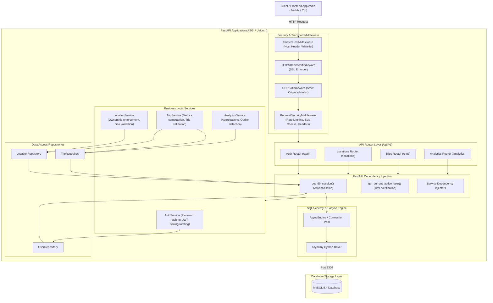
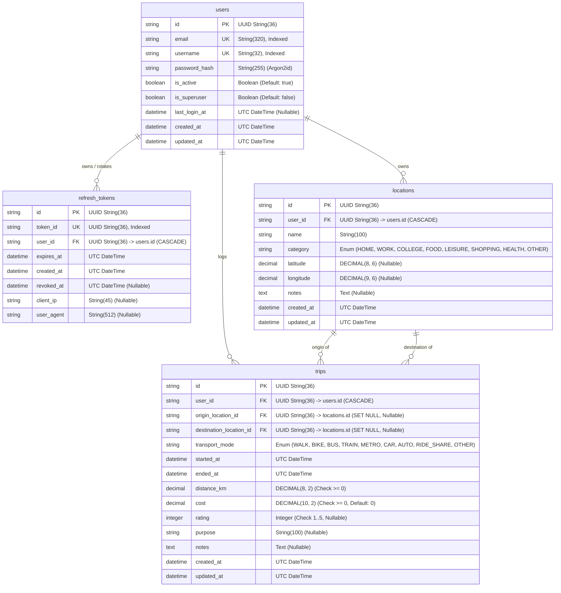

<div align="center">

# 🏙️ CityPulse — Privacy-Conscious Mobility & Urban Analytics

[](https://www.python.org/)
[](https://fastapi.tiangolo.com/)
[](https://www.uvicorn.org/)
[](https://www.sqlalchemy.org/)
[](https://github.com/long2ice/asyncmy)
[](https://www.mysql.com/)
[](https://www.docker.com/)
[](https://docs.pydantic.dev/)
[](https://pyjwt.readthedocs.io/)
[](https://github.com/frankie567/pwdlib)
[](https://pytest.org/)
[](https://docs.astral.sh/ruff/)
[](LICENSE)

*An enterprise-grade, privacy-conscious mobility and urban analytics backend with Argon2id authentication, rotating JWT tokens, spatio-temporal location tracking, and statistical outlier detection.*

<br/>

[Architecture](#-system-architecture-diagram) • [Database Schema](#-database-schema--er-diagram) • [Getting Started](#-quick-start--setup) • [API Reference](#-api-endpoints-overview) • [Detailed Setup Guide](SETUP.md) • [Tech Stack](#-technology-stack)

</div>

---

## 📑 Table of Contents

- [Technology Stack](#-technology-stack)
- [System Architecture Diagram](#-system-architecture-diagram)
- [Database Schema & ER Diagram](#-database-schema--er-diagram)
- [Quick Start & Setup](#-quick-start--setup)
- [API Endpoints Overview](#-api-endpoints-overview)
- [Security Model & Baseline](#-security-model--baseline)
- [Project Directory Structure](#-project-directory-structure)
- [Testing & Quality Assurance](#-testing--quality-assurance)
- [Detailed Setup Guide](SETUP.md)

---

## 🚀 Technology Stack

| Layer / Concern | Technology | Version / Spec | Purpose & Justification |
|---|---|---|---|
| **Web Framework** | [FastAPI](https://fastapi.tiangolo.com/) | `>=0.128` | High-performance async REST API with automatic OpenAPI documentation and dependency injection. |
| **ASGI Server** | [Uvicorn](https://www.uvicorn.org/) | `>=0.40` | Lightning-fast async server with standard protocol support and live-reload worker management. |
| **ORM & Persistence** | [SQLAlchemy](https://www.sqlalchemy.org/) | `>=2.0.46` | Modern async 2.0 syntax with mapped columns, strong typing, and relationship cascading. |
| **Async DB Driver** | [asyncmy](https://github.com/long2ice/asyncmy) | `>=0.2.10` | High-throughput asynchronous driver for MySQL using asyncio and Cython extensions. |
| **Database** | [MySQL](https://www.mysql.com/) | `8.4 LTS` | Relational storage engine with native JSON, transactional guarantees, and strict constraints. |
| **Schema Migrations**| [Alembic](https://alembic.sqlalchemy.org/) | `>=1.18` | Version-controlled, idempotent database schema migrations with async context support. |
| **Data Validation** | [Pydantic v2](https://docs.pydantic.dev/) | `v2+` / `pydantic-settings` | Strict schema validation, environment configuration parsing, and input sanitization. |
| **Authentication** | [PyJWT](https://pyjwt.readthedocs.io/) | `>=2.11` | Cryptographic JWT token encoding, verification, and rotation. |
| **Password Hashing** | [pwdlib](https://github.com/frankie567/pwdlib) | `[argon2] >=0.3` | State-of-the-art Argon2id cryptographic hashing to resist GPU/ASIC attacks. |
| **Testing** | [pytest](https://pytest.org/) & [pytest-asyncio](https://github.com/pytest-dev/pytest-asyncio) | `>=9.0` / `>=1.3` | Async unit, security, and integration test suite with fixture scopes. |
| **Code Quality** | [Ruff](https://docs.astral.sh/ruff/) | `>=0.14` | High-speed linter and formatter enforcing modern Python idioms. |

---

## 🏛 System Architecture Diagram

The CityPulse API follows a strict separation of concerns with unidirectional dependency flow:



---

## 📊 Database Schema & ER Diagram

CityPulse models data around user ownership, privacy isolation, revocable tokens, saved locations, and recorded mobility trips.



---

## ⚡ Quick Start & Setup

> 💡 *For a detailed installation walkthrough, prerequisites, and troubleshooting guide, please see [SETUP.md](SETUP.md).*

### 1. Set Up Environment & Install Dependencies

```powershell
# Create and activate virtual environment
python -m venv .venv
.\.venv\Scripts\Activate.ps1   # On Linux/macOS: source .venv/bin/activate

# Install requirements
pip install -r requirements.txt

# Configure environment file
Copy-Item .env.example .env     # On Linux/macOS: cp .env.example .env
```

### 2. Start MySQL (Docker)

```powershell
docker compose up -d mysql
```

### 3. Run Migrations & Start Server

```powershell
# Apply Alembic database migrations
alembic upgrade head

# Start Uvicorn development server
uvicorn app.main:app --reload --host 127.0.0.1 --port 8000
```

### 4. Access Interactive Documentation

Open [http://127.0.0.1:8000/api/v1/docs](http://127.0.0.1:8000/api/v1/docs) in your browser.

---

## 📡 API Endpoints Overview

All v1 routes are mounted under `/api/v1`:

| Domain | Method | Endpoint | Description | Auth Required |
|---|---|---|---|:---:|
| **Health** | `GET` | `/health` | Server liveness check | No |
| **Auth** | `POST` | `/api/v1/auth/register` | Register a new user account | No |
| **Auth** | `POST` | `/api/v1/auth/login` | Authenticate with credentials (issues access + refresh tokens) | No |
| **Auth** | `POST` | `/api/v1/auth/refresh` | Rotate refresh token & issue new access token | No |
| **Auth** | `POST` | `/api/v1/auth/logout` | Revoke active refresh token | Yes |
| **Auth** | `GET` | `/api/v1/auth/me` | Retrieve profile of authenticated user | Yes |
| **Locations** | `POST` | `/api/v1/locations/` | Create a new user location | Yes |
| **Locations** | `GET` | `/api/v1/locations/` | List all locations for authenticated user | Yes |
| **Locations** | `GET` | `/api/v1/locations/{id}` | Get details of a specific location | Yes |
| **Locations** | `PATCH` | `/api/v1/locations/{id}` | Update an existing location | Yes |
| **Locations** | `DELETE` | `/api/v1/locations/{id}` | Delete a location | Yes |
| **Trips** | `POST` | `/api/v1/trips/` | Log a new mobility journey / trip | Yes |
| **Trips** | `GET` | `/api/v1/trips/` | List user trips with pagination & filters | Yes |
| **Trips** | `GET` | `/api/v1/trips/{id}` | Get details of a single trip | Yes |
| **Trips** | `PATCH` | `/api/v1/trips/{id}` | Update trip attributes | Yes |
| **Trips** | `DELETE` | `/api/v1/trips/{id}` | Delete a trip record | Yes |
| **Analytics** | `GET` | `/api/v1/analytics/summary` | Aggregate metrics (total trips, distance, cost, duration) | Yes |
| **Analytics** | `GET` | `/api/v1/analytics/transport-modes` | Breakdown by transportation mode | Yes |
| **Analytics** | `GET` | `/api/v1/analytics/daily-distance` | Daily mobility distance time-series | Yes |
| **Analytics** | `GET` | `/api/v1/analytics/outliers` | Statistical speed and distance outlier detection | Yes |

---

## 🔒 Security Model & Baseline

- **Argon2id Password Hashing**: State-of-the-art password hashing using `pwdlib[argon2]`.
- **Rotating Refresh Tokens**: Refresh tokens are stored by unique token ID, rotated on every refresh, and revoked on logout.
- **Reuse Detection**: Automatic revocation and reuse protection for refresh tokens.
- **Strict Data Isolation**: Multi-tenant data segregation where every query is strictly constrained to the authenticated user (`user_id`).
- **Defensive HTTP Headers**: Content-Security-Policy, X-Frame-Options, X-Content-Type-Options, Referrer-Policy, and Permissions-Policy.
- **Per-IP Rate Throttling**: Sliding window rate limiting middleware to prevent brute force and DDoS attacks.
- **Strict CORS & Host Whitelist**: Whitelist-based origin and host validation.

---

## 📁 Project Directory Structure

```text
backend/
├── alembic/                      # Database migrations
│   ├── versions/                 # Revision scripts
│   └── env.py                    # Async migration runtime environment
├── app/
│   ├── api/                      # HTTP Routers & Dependency Injection
│   │   ├── deps.py               # Authentication & DB session dependencies
│   │   └── v1/                   # Version 1 API route endpoints
│   ├── core/                     # Core configs, security & exceptions
│   │   ├── config.py             # Pydantic Settings & environment loader
│   │   ├── exceptions.py         # Domain error hierarchy
│   │   └── security.py           # Password hashing & JWT token generators
│   ├── db/                       # Database setup & types
│   │   ├── base.py               # Declarative SQLAlchemy base
│   │   ├── session.py            # Async engine & sessionmaker
│   │   └── types.py              # UTC DateTime cross-dialect handler
│   ├── middleware/               # HTTP security, rate limiting & headers
│   │   └── security.py           # RequestSecurityMiddleware
│   ├── models/                   # SQLAlchemy ORM database models
│   │   ├── location.py           # Location entity
│   │   ├── mixins.py             # UUID and timestamp reusable mixins
│   │   ├── refresh_token.py      # RefreshToken entity
│   │   ├── trip.py               # Trip entity
│   │   └── user.py               # User entity
│   ├── repositories/             # Data Access Layer (Clean Architecture)
│   │   ├── location.py           # Location queries & persistence
│   │   ├── trip.py               # Trip queries & aggregations
│   │   └── user.py               # User & token persistence
│   ├── schemas/                  # Pydantic Request & Response DTOs
│   │   ├── analytics.py          # Analytics response schemas
│   │   ├── auth.py               # Registration, Login, Token schemas
│   │   ├── location.py           # Location CRUD schemas
│   │   └── trip.py               # Trip CRUD schemas
│   ├── services/                 # Business Logic Layer
│   │   ├── analytics.py          # Mobility analytics & outlier math
│   │   ├── auth.py               # User registration & token lifecycle
│   │   ├── location.py           # Location validation & operations
│   │   └── trip.py               # Trip calculation & CRUD operations
│   └── main.py                   # FastAPI application factory & middleware setup
├── tests/                        # Automated Pytest suite
│   ├── test_http_security.py     # Middleware & security header tests
│   ├── test_schemas.py           # Validation schema tests
│   └── test_security.py          # Password & JWT crypto tests
├── .env                          # Local environment secrets (ignored by git)
├── .env.example                  # Environment configuration template
├── alembic.ini                   # Alembic configuration
├── docker-compose.yml            # Local MySQL 8.4 Docker service
├── pyproject.toml                # Project metadata & tool configuration
├── requirements.txt              # Production and development dependencies
├── SETUP.md                      # Comprehensive setup & installation guide
└── README.md                     # Project documentation overview
```

---

## 🧪 Testing & Quality Assurance

```powershell
# Run the complete test suite
pytest

# Run tests with verbose output
pytest -v

# Run code linter
ruff check .

# Format code
ruff format .
```

---

## 📄 License & Proprietary Notice

Copyright © 2026 SHAW258. All rights reserved.

This project and its source code are **Proprietary and Confidential**. Public viewing of this repository is permitted solely for demonstration, inspection, and portfolio evaluation. Unauthorized copying, cloning for derivation, distribution, reproduction, or commercial deployment without prior written permission from the copyright holder is strictly prohibited. See the [LICENSE](LICENSE) file for complete terms.

