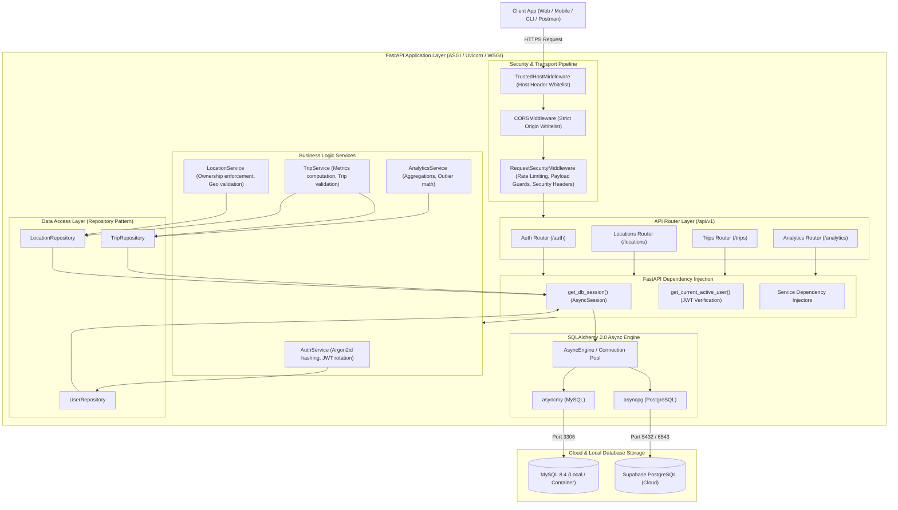

# 🏛 System Architecture & Design

This document details the architectural topology, design patterns, and layer responsibilities of the **CityPulse API**.

---

## 🏗 High-Level Architecture Flowchart

---

## 🧩 Architectural Principles & Patterns

### 1. Clean Layered Architecture
- **Routers (`app/api/v1/`)**: Pure HTTP transport layer. Validates inputs via Pydantic DTOs and handles HTTP status codes.
- **Dependency Injection (`app/api/deps.py`)**: Resolves authentication, token decoding, database async sessions, and service instances.
- **Service Layer (`app/services/`)**: Enforces business domain logic, password verification, token rotation compromise detection, and statistical outlier math.
- **Repository Layer (`app/repositories/`)**: Abstracted data access with SQLAlchemy 2.0 async queries.
- **Models (`app/models/`)**: Declarative database schema definitions with strict constraints.

### 2. Dual-Engine Async Database Support
- **PostgreSQL / Supabase**: High-performance async operations via `asyncpg`.
- **MySQL 8.4 LTS**: Supported via `asyncmy` driver.
- **UTC Datetime Serialization**: Cross-dialect `UTCDateTime` type ensuring timezone consistency across engines.

### 3. Defense-in-Depth Security
- **Argon2id Cryptographic Hashing**: Memory-hard password hashing.
- **Single-Use JWT Refresh Tokens**: Automatic user session revocation if token reuse is detected.
- **Sliding-Window IP Rate Limiter**: Middleware-level traffic throttling.
- **Security Headers**: HSTS, CSP, X-Content-Type-Options (`nosniff`), X-Frame-Options (`DENY`).

### 4. Synchronous WSGI Adapter (`SyncASGIMiddleware`)
- Located in [`wsgi.py`](../wsgi.py), allowing deployment on standard single-threaded WSGI hosts without Gunicorn/Uvicorn ASGI prerequisites.

---

[⬅ Back to Main README](../README.md) • [Next: Database Schema ➡](DATABASE_SCHEMA.md)
