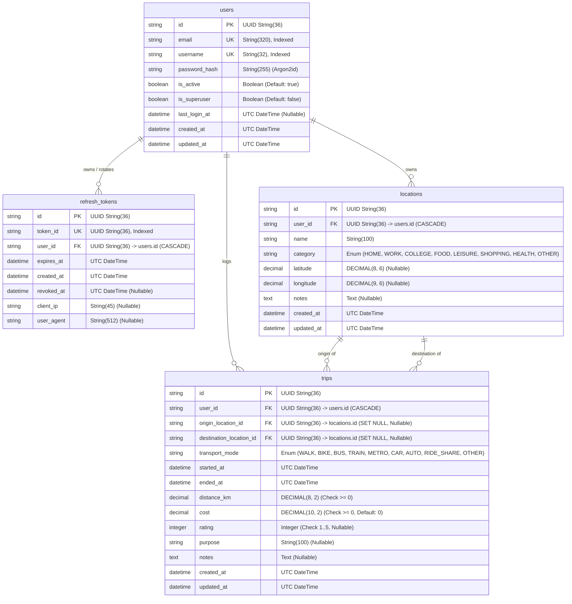

# 📊 Database Schema & ER Diagram

This document contains the Entity-Relationship (ER) diagram, table structures, column definitions, constraints, and indexes for the **CityPulse API**.

---

## 🗺️ Entity Relationship Diagram

---

## 🗄️ Detailed Data Dictionary

### 1. `users` Table
Stores authenticated accounts with Argon2id cryptographic password hashes.
- `id` (VARCHAR(36), PK): UUID v4 identifier.
- `email` (VARCHAR(320), UNIQUE, NOT NULL, INDEX): Normalized lowercase email.
- `username` (VARCHAR(32), UNIQUE, NOT NULL, INDEX): Account username.
- `password_hash` (VARCHAR(255), NOT NULL): Non-reversible Argon2id hash.
- `is_active` (BOOLEAN, DEFAULT TRUE, NOT NULL): Soft-deletion flag.
- `is_superuser` (BOOLEAN, DEFAULT FALSE, NOT NULL): Admin flag.
- `last_login_at` (TIMESTAMPTZ, NULLABLE): UTC timestamp of last login.
- `created_at` / `updated_at` (TIMESTAMPTZ, NOT NULL): Timestamps.

### 2. `refresh_tokens` Table
Tracks revocable single-use JWT refresh tokens to support automated token-theft compromise detection.
- `id` (VARCHAR(36), PK): UUID v4 record ID.
- `token_id` (VARCHAR(36), UNIQUE, NOT NULL, INDEX): UUID embedded in JWT payload.
- `user_id` (VARCHAR(36), FK -> users.id, CASCADE, NOT NULL): Owner ID.
- `expires_at` (TIMESTAMPTZ, NOT NULL): Expiration timestamp (7 days).
- `revoked_at` (TIMESTAMPTZ, NULLABLE): Timestamp when token was burned.
- `client_ip` / `user_agent` (VARCHAR, NULLABLE): Audit log data.

### 3. `locations` Table
User-owned saved places and geofencing anchors.
- `id` (VARCHAR(36), PK): UUID v4 location identifier.
- `user_id` (VARCHAR(36), FK -> users.id, CASCADE, NOT NULL): Owner ID.
- `name` (VARCHAR(100), NOT NULL): Location display name.
- `category` (VARCHAR(20), NOT NULL): One of `home`, `work`, `college`, `food`, `leisure`, `shopping`, `health`, `other`.
- `latitude` (DECIMAL(8,6), NULLABLE): Latitude in range `[-90, 90]`.
- `longitude` (DECIMAL(9,6), NULLABLE): Longitude in range `[-180, 180]`.
- `notes` (TEXT, NULLABLE): User remarks.

### 4. `trips` Table
Spatiotemporal mobility events and journey history.
- `id` (VARCHAR(36), PK): UUID v4 trip identifier.
- `user_id` (VARCHAR(36), FK -> users.id, CASCADE, NOT NULL): Owner ID.
- `origin_location_id` / `destination_location_id` (VARCHAR(36), FK -> locations.id, SET NULL, NULLABLE): Place links.
- `transport_mode` (VARCHAR(20), NOT NULL): Transit mode enum.
- `started_at` / `ended_at` (TIMESTAMPTZ, NOT NULL): Journey start/end times with timezone.
- `distance_km` (DECIMAL(8,2), NOT NULL, CHECK >= 0): Distance in kilometers.
- `cost` (DECIMAL(10,2), NOT NULL, DEFAULT 0, CHECK >= 0): Trip expenditure.
- `rating` (INTEGER, NULLABLE, CHECK BETWEEN 1 AND 5): Star rating.
- `purpose` (VARCHAR(100), NULLABLE): Journey motive.
- `notes` (TEXT, NULLABLE): Private notes.

---

[⬅ Back to Main README](../README.md) • [Next: API Reference ➡](API_REFERENCE.md)
