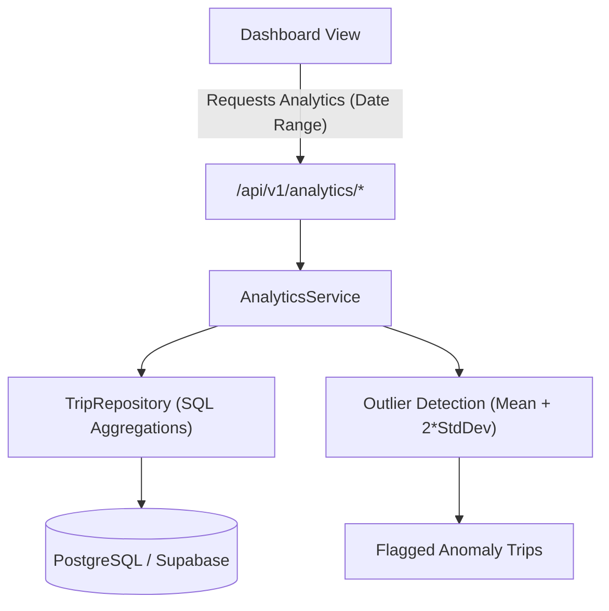

# 📊 Mobility Analytics & Anomaly Detection Module (`analytics`)

The **Analytics Module** computes real-time mobility metrics, transportation mode distributions, daily time-series distance trends, and **statistical outlier anomalies** (e.g. unusually long distances or speeds) across user journeys.

---

## 📑 Table of Contents

1. [Architectural Overview & Statistical Engine](#-architectural-overview--statistical-engine)
2. [Data Aggregation Models](#-data-aggregation-models)
3. [API Endpoints Reference](#-api-endpoints-reference)
4. [TypeScript Data Transfer Objects (DTOs)](#-typescript-data-transfer-objects-dtos)
5. [Frontend & Mobile Integration Guide](#-frontend--mobile-integration-guide)
   - [API Client Service (`analyticsApi.ts`)](#1-api-client-service)
   - [React Query Custom Hooks](#2-react-query-custom-hooks)
   - [UI Component: AnalyticsKPICards](#3-ui-component-analyticskpicards)
   - [UI Component: ModeDistributionPieChart (Recharts)](#4-ui-component-modedistributionpiechart)
   - [UI Component: DailyDistanceAreaChart (Recharts)](#5-ui-component-dailydistanceareachart)
   - [UI Component: AnomalyOutlierAlertBanner](#6-ui-component-anomalyoutlieralertbanner)
6. [Date Window Constraints & Defaults](#-date-window-constraints--defaults)
7. [Error Handling Matrix](#-error-handling-matrix)
8. [Testing with cURL & Swagger](#-testing-with-curl--swagger)

---

## 📈 Architectural Overview & Statistical Engine



### Analytics Capabilities:
1. **Summary KPIs**: Computes total distance (km), total expenditure, total transit duration (minutes), mean distance per trip, and trip volume.
2. **Modal Split (Mode Breakdown)**: Calculates market share percentage, trip counts, total distance, and expenditure for every transportation mode.
3. **Daily Time-Series**: Groups daily travel volume, distance, and costs for charting trends.
4. **Outlier Anomaly Detection**: Employs statistical thresholding ($\mu + 2\sigma$) to flag journeys with anomalous distances or transit patterns.

---

## 🗄️ Data Aggregation Models

All analytics computations are bounded strictly to the authenticated `user_id` and an optional date range (`from_date` to `to_date`). If dates are omitted, the backend defaults to the **last 30 days**.

---

## 📡 API Endpoints Reference

### Base URL: `/api/v1/analytics`
All endpoints require `Authorization: Bearer <access_token>`

| Method | Endpoint | Query Parameters | Description |
| :--- | :--- | :--- | :--- |
| `GET` | `/summary` | `from_date`, `to_date` | Overall summary KPIs across the selected date range |
| `GET` | `/by-mode` | `from_date`, `to_date` | Aggregated breakdown grouped by transit mode |
| `GET` | `/daily-distance` | `from_date`, `to_date` | Chronological time-series of daily distances and costs |
| `GET` | `/outliers` | `from_date`, `to_date` | Statistically anomalous journeys flagged as outliers |

---

### 1. Overall Summary KPIs
- **Route**: `GET /api/v1/analytics/summary`
- **Query Params**: `from_date=2026-08-01&to_date=2026-08-14`
- **Response `200 OK`**:
```json
{
  "from_date": "2026-08-01",
  "to_date": "2026-08-14",
  "trip_count": 28,
  "total_distance_km": "342.50",
  "total_cost": "1250.00",
  "total_duration_minutes": 890,
  "average_distance_km": "12.23"
}
```

---

### 2. Transport Mode Breakdown
- **Route**: `GET /api/v1/analytics/by-mode`
- **Response `200 OK`**:
```json
[
  {
    "mode": "metro",
    "trip_count": 14,
    "total_distance_km": "196.00",
    "total_cost": "630.00",
    "percent_of_trips": "50.00"
  },
  {
    "mode": "bike",
    "trip_count": 8,
    "total_distance_km": "48.50",
    "total_cost": "0.00",
    "percent_of_trips": "28.57"
  },
  {
    "mode": "walk",
    "trip_count": 6,
    "total_distance_km": "18.00",
    "total_cost": "0.00",
    "percent_of_trips": "21.43"
  }
]
```

---

### 3. Daily Distance Time-Series
- **Route**: `GET /api/v1/analytics/daily-distance`
- **Response `200 OK`**:
```json
[
  {
    "date": "2026-08-13",
    "trip_count": 2,
    "total_distance_km": "24.50",
    "total_cost": "90.00"
  },
  {
    "date": "2026-08-14",
    "trip_count": 3,
    "total_distance_km": "31.20",
    "total_cost": "115.00"
  }
]
```

---

### 4. Statistical Outliers
- **Route**: `GET /api/v1/analytics/outliers`
- **Response `200 OK`**:
```json
[
  {
    "trip_id": "7fa85f64-5717-4562-b3fc-2c963f66afa9",
    "started_at": "2026-08-12T06:00:00Z",
    "distance_km": "85.40",
    "threshold_km": "42.10",
    "reason": "Distance exceeds mean + 2σ threshold"
  }
]
```

---

## 📐 TypeScript Data Transfer Objects (DTOs)

Add to `src/types/analytics.ts`:

```typescript
import { TransportMode } from './trip';

export interface SummaryResponse {
  from_date: string;
  to_date: string;
  trip_count: number;
  total_distance_km: string; // "342.50"
  total_cost: string;        // "1250.00"
  total_duration_minutes: number;
  average_distance_km: string;
}

export interface TransportModeBreakdown {
  mode: TransportMode;
  trip_count: number;
  total_distance_km: string;
  total_cost: string;
  percent_of_trips: string; // "50.00"
}

export interface DailyDistancePoint {
  date: string; // "YYYY-MM-DD"
  trip_count: number;
  total_distance_km: string;
  total_cost: string;
}

export interface OutlierResponse {
  trip_id: string;
  started_at: string;
  distance_km: string;
  threshold_km: string;
  reason: string;
}

export interface AnalyticsQueryParams {
  from_date?: string; // "YYYY-MM-DD"
  to_date?: string;   // "YYYY-MM-DD"
}
```

---

## 💻 Frontend & Mobile Integration Guide

### 1. API Client Service
Create `src/api/analyticsApi.ts`:

```typescript
import { apiClient } from './client';
import {
  SummaryResponse,
  TransportModeBreakdown,
  DailyDistancePoint,
  OutlierResponse,
  AnalyticsQueryParams,
} from '../types/analytics';

export const analyticsApi = {
  getSummary: async (params?: AnalyticsQueryParams): Promise<SummaryResponse> => {
    const { data } = await apiClient.get<SummaryResponse>('/api/v1/analytics/summary', { params });
    return data;
  },

  getByMode: async (params?: AnalyticsQueryParams): Promise<TransportModeBreakdown[]> => {
    const { data } = await apiClient.get<TransportModeBreakdown[]>('/api/v1/analytics/by-mode', { params });
    return data;
  },

  getDailyDistance: async (params?: AnalyticsQueryParams): Promise<DailyDistancePoint[]> => {
    const { data } = await apiClient.get<DailyDistancePoint[]>('/api/v1/analytics/daily-distance', { params });
    return data;
  },

  getOutliers: async (params?: AnalyticsQueryParams): Promise<OutlierResponse[]> => {
    const { data } = await apiClient.get<OutlierResponse[]>('/api/v1/analytics/outliers', { params });
    return data;
  },
};
```

---

### 2. React Query Custom Hooks
Create `src/hooks/useAnalytics.ts`:

```typescript
import { useQuery } from '@tanstack/react-query';
import { analyticsApi } from '../api/analyticsApi';
import { AnalyticsQueryParams } from '../types/analytics';

export const useAnalyticsSummary = (params?: AnalyticsQueryParams) => {
  return useQuery({
    queryKey: ['analytics', 'summary', params],
    queryFn: () => analyticsApi.getSummary(params),
  });
};

export const useAnalyticsByMode = (params?: AnalyticsQueryParams) => {
  return useQuery({
    queryKey: ['analytics', 'by-mode', params],
    queryFn: () => analyticsApi.getByMode(params),
  });
};

export const useDailyDistance = (params?: AnalyticsQueryParams) => {
  return useQuery({
    queryKey: ['analytics', 'daily-distance', params],
    queryFn: () => analyticsApi.getDailyDistance(params),
  });
};

export const useAnalyticsOutliers = (params?: AnalyticsQueryParams) => {
  return useQuery({
    queryKey: ['analytics', 'outliers', params],
    queryFn: () => analyticsApi.getOutliers(params),
  });
};
```

---

### 3. UI Component: AnalyticsKPICards

```tsx
import React from 'react';
import { SummaryResponse } from '../types/analytics';

export const AnalyticsKPICards: React.FC<{ summary: SummaryResponse }> = ({ summary }) => {
  return (
    <div style={{ display: 'grid', gridTemplateColumns: 'repeat(auto-fit, minmax(200px, 1fr))', gap: 16, marginBottom: 24 }}>
      <div style={{ padding: 16, background: '#f8fafc', borderRadius: 8, border: '1px solid #e2e8f0' }}>
        <span style={{ fontSize: 13, color: '#64748b' }}>Total Trips</span>
        <h2 style={{ margin: '4px 0 0 0', color: '#0f172a' }}>{summary.trip_count}</h2>
      </div>

      <div style={{ padding: 16, background: '#f8fafc', borderRadius: 8, border: '1px solid #e2e8f0' }}>
        <span style={{ fontSize: 13, color: '#64748b' }}>Total Distance</span>
        <h2 style={{ margin: '4px 0 0 0', color: '#0284c7' }}>{summary.total_distance_km} km</h2>
      </div>

      <div style={{ padding: 16, background: '#f8fafc', borderRadius: 8, border: '1px solid #e2e8f0' }}>
        <span style={{ fontSize: 13, color: '#64748b' }}>Total Transit Cost</span>
        <h2 style={{ margin: '4px 0 0 0', color: '#16a34a' }}>${summary.total_cost}</h2>
      </div>

      <div style={{ padding: 16, background: '#f8fafc', borderRadius: 8, border: '1px solid #e2e8f0' }}>
        <span style={{ fontSize: 13, color: '#64748b' }}>Total Time</span>
        <h2 style={{ margin: '4px 0 0 0', color: '#8b5cf6' }}>{Math.round(summary.total_duration_minutes / 60)} hrs</h2>
      </div>
    </div>
  );
};
```

---

### 4. UI Component: ModeDistributionPieChart
Example using `recharts`:

```tsx
import React from 'react';
import { PieChart, Pie, Cell, Tooltip, ResponsiveContainer, Legend } from 'recharts';
import { TransportModeBreakdown } from '../types/analytics';

const COLORS = ['#0284c7', '#16a34a', '#f59e0b', '#8b5cf6', '#ec4899', '#64748b'];

export const ModeDistributionChart: React.FC<{ data: TransportModeBreakdown[] }> = ({ data }) => {
  const chartData = data.map((item) => ({
    name: item.mode.toUpperCase(),
    value: Number(item.total_distance_km),
  }));

  return (
    <div style={{ background: '#fff', padding: 16, borderRadius: 8, border: '1px solid #e2e8f0', height: 320 }}>
      <h4 style={{ margin: '0 0 12px 0' }}>Distance by Transport Mode</h4>
      <ResponsiveContainer width="100%" height="85%">
        <PieChart>
          <Pie data={chartData} dataKey="value" nameKey="name" cx="50%" cy="50%" outerRadius={80} label>
            {chartData.map((_, index) => (
              <Cell key={`cell-${index}`} fill={COLORS[index % COLORS.length]} />
            ))}
          </Pie>
          <Tooltip formatter={(value) => `${value} km`} />
          <Legend />
        </PieChart>
      </ResponsiveContainer>
    </div>
  );
};
```

---

### 5. UI Component: DailyDistanceAreaChart

```tsx
import React from 'react';
import { AreaChart, Area, XAxis, YAxis, Tooltip, ResponsiveContainer } from 'recharts';
import { DailyDistancePoint } from '../types/analytics';

export const DailyDistanceChart: React.FC<{ data: DailyDistancePoint[] }> = ({ data }) => {
  const formattedData = data.map((item) => ({
    ...item,
    distance: Number(item.total_distance_km),
  }));

  return (
    <div style={{ background: '#fff', padding: 16, borderRadius: 8, border: '1px solid #e2e8f0', height: 320 }}>
      <h4 style={{ margin: '0 0 12px 0' }}>Daily Distance Traveled (km)</h4>
      <ResponsiveContainer width="100%" height="85%">
        <AreaChart data={formattedData}>
          <XAxis dataKey="date" />
          <YAxis unit=" km" />
          <Tooltip formatter={(val) => [`${val} km`, 'Distance']} />
          <Area type="monotone" dataKey="distance" stroke="#0284c7" fill="#bae6fd" />
        </AreaChart>
      </ResponsiveContainer>
    </div>
  );
};
```

---

### 6. UI Component: AnomalyOutlierAlertBanner

```tsx
import React from 'react';
import { OutlierResponse } from '../types/analytics';

export const OutlierAlertBanner: React.FC<{ outliers: OutlierResponse[] }> = ({ outliers }) => {
  if (!outliers || outliers.length === 0) return null;

  return (
    <div style={{ background: '#fef2f2', border: '1px solid #fecaca', borderRadius: 8, padding: 16, marginBottom: 20 }}>
      <h4 style={{ color: '#991b1b', margin: '0 0 8px 0' }}>⚠️ Unusual Journey Anomalies Detected ({outliers.length})</h4>
      <ul style={{ margin: 0, paddingLeft: 20, fontSize: 14, color: '#7f1d1d' }}>
        {outliers.map((outlier) => (
          <li key={outlier.trip_id} style={{ marginBottom: 4 }}>
            Trip on {new Date(outlier.started_at).toLocaleDateString()}: Traveled <b>{outlier.distance_km} km</b> (Threshold: {outlier.threshold_km} km) — {outlier.reason}
          </li>
        ))}
      </ul>
    </div>
  );
};
```

---

## 🔒 Date Window Constraints & Defaults

| Query Parameter | Format | Default Behavior |
| :--- | :--- | :--- |
| `from_date` | `YYYY-MM-DD` (ISO Date) | Defaults to 30 days prior to today |
| `to_date` | `YYYY-MM-DD` (ISO Date) | Defaults to current date |

---

## ⚠️ Error Handling Matrix

| HTTP Status | Trigger Reason | Response `detail` Example |
| :--- | :--- | :--- |
| `401 Unauthorized` | Missing or invalid Bearer token | `"Could not validate credentials"` |
| `422 Unprocessable`| Invalid date string format (e.g. `14-08-2026` instead of `2026-08-14`) | `[{"loc": ["query", "from_date"], "msg": "Input should be a valid date"}]` |

---

## 🧪 Testing with cURL & Swagger

### 1. Fetch Summary Analytics with cURL
```bash
curl -X GET "https://citypulse-api-tjpr.onrender.com/api/v1/analytics/summary" \
     -H "Authorization: Bearer <YOUR_ACCESS_TOKEN>"
```

### 2. Fetch Transportation Mode Breakdown with cURL
```bash
curl -X GET "https://citypulse-api-tjpr.onrender.com/api/v1/analytics/by-mode" \
     -H "Authorization: Bearer <YOUR_ACCESS_TOKEN>"
```

### 3. Fetch Anomalies / Outliers with cURL
```bash
curl -X GET "https://citypulse-api-tjpr.onrender.com/api/v1/analytics/outliers" \
     -H "Authorization: Bearer <YOUR_ACCESS_TOKEN>"
```
