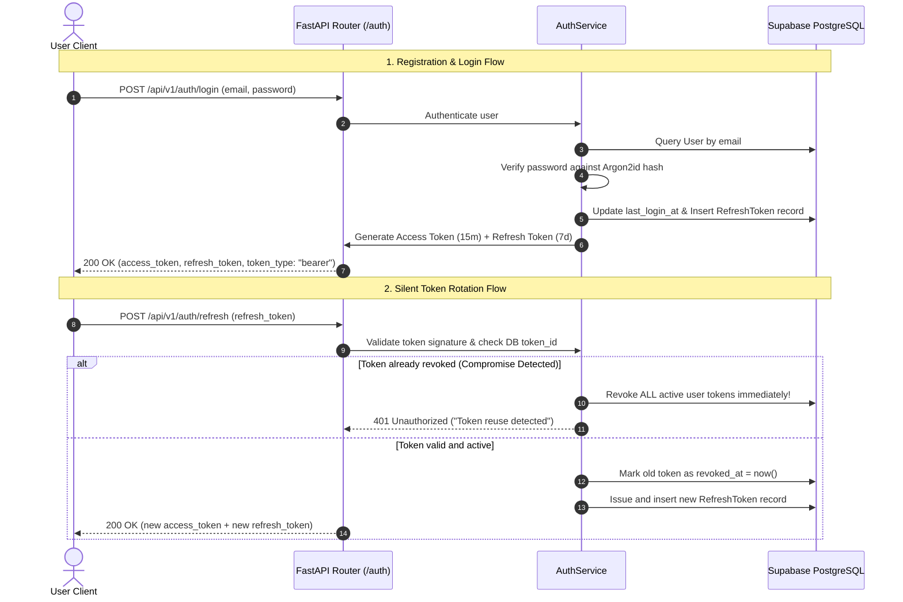

# 🔐 Authentication & User Profile Module (`auth`)

The **Authentication & User Management Module** provides enterprise-grade, cryptographically hardened account management. It incorporates **Argon2id password hashing**, **short-lived JWT access tokens**, and **rotating single-use refresh tokens** with automated token reuse detection.

---

## 📑 Table of Contents

1. [Architectural Overview & Security Model](#-architectural-overview--security-model)
2. [Database Schema & Token Lifecycle](#-database-schema--token-lifecycle)
3. [API Endpoints Reference](#-api-endpoints-reference)
4. [TypeScript Data Transfer Objects (DTOs)](#-typescript-data-transfer-objects-dtos)
5. [Frontend & Mobile Integration Guide](#-frontend--mobile-integration-guide)
   - [Axios Client with Auto-Refresh & Queue](#1-central-axios-client-with-token-refresh-interceptor)
   - [React AuthContext & Custom Hook](#2-react-auth-context--custom-hook)
   - [UI Component: LoginForm (React + Zod)](#3-ui-component-loginform-with-validation)
6. [Validation Rules & Security Policies](#-validation-rules--security-policies)
7. [Error Handling Matrix](#-error-handling-matrix)
8. [Testing with cURL & Swagger](#-testing-with-curl--swagger)

---

## 🛡️ Architectural Overview & Security Model



### Key Security Specifications:
- **Password Hashing**: Argon2id with cryptographically secure salts. Raw passwords never hit persistence layers.
- **Access Token Duration**: `15 minutes` (stateless JWT containing `sub`, `user_id`, `email`, `username`).
- **Refresh Token Duration**: `7 days` (stateful JWT carrying a unique `token_id` UUID stored in DB).
- **Single-Use Rotation**: Every refresh request burns the current refresh token and issues a new pair.
- **Compromise Detection**: If an already revoked refresh token is presented again (indicating token theft), the backend automatically invalidates **all** active sessions for that user account.

---

## 🗄️ Database Schema & Token Lifecycle

### `users` Table
| Column | Type | Constraints | Description |
| :--- | :--- | :--- | :--- |
| `id` | `VARCHAR(36)` | `PRIMARY KEY` | UUID v4 user identifier |
| `email` | `VARCHAR(320)` | `UNIQUE, NOT NULL, INDEX` | Account email (stored normalized lowercase) |
| `username` | `VARCHAR(32)` | `UNIQUE, NOT NULL, INDEX` | Account username (alphanumeric, dot, dash, underscore) |
| `password_hash` | `VARCHAR(255)` | `NOT NULL` | Argon2id cryptographic hash string |
| `is_active` | `BOOLEAN` | `DEFAULT TRUE, NOT NULL` | Soft-enable flag for account status |
| `is_superuser` | `BOOLEAN` | `DEFAULT FALSE, NOT NULL` | Admin privilege flag |
| `last_login_at` | `TIMESTAMPTZ` | `NULLABLE` | UTC timestamp of most recent successful login |
| `created_at` | `TIMESTAMPTZ` | `NOT NULL` | Account registration UTC timestamp |
| `updated_at` | `TIMESTAMPTZ` | `NOT NULL` | Account profile last update timestamp |

### `refresh_tokens` Table
| Column | Type | Constraints | Description |
| :--- | :--- | :--- | :--- |
| `id` | `VARCHAR(36)` | `PRIMARY KEY` | UUID v4 record identifier |
| `token_id` | `VARCHAR(36)` | `UNIQUE, NOT NULL, INDEX` | UUID embedded within the JWT token claims |
| `user_id` | `VARCHAR(36)` | `FK -> users.id (CASCADE)` | Owner user UUID |
| `expires_at` | `TIMESTAMPTZ` | `NOT NULL` | Expiration timestamp (7 days) |
| `revoked_at` | `TIMESTAMPTZ` | `NULLABLE` | Timestamp when revoked/burned |
| `client_ip` | `VARCHAR(45)` | `NULLABLE` | IP address of the requesting client |
| `user_agent` | `VARCHAR(512)` | `NULLABLE` | Client Browser / Device User-Agent |

---

## 📡 API Endpoints Reference

### Base URL: `/api/v1/auth`

| Method | Endpoint | Auth Required | Description |
| :--- | :--- | :---: | :--- |
| `POST` | `/register` | ❌ No | Create a new user account |
| `POST` | `/login` | ❌ No | Authenticate with credentials and obtain token pair |
| `POST` | `/refresh` | ❌ No | Rotate refresh token to receive a new access + refresh token |
| `POST` | `/logout` | ✅ Bearer | Burn the active refresh token and end session |
| `POST` | `/revoke-all` | ✅ Bearer | Revoke all active sessions across all devices for current user |
| `GET` | `/me` | ✅ Bearer | Retrieve profile information for the authenticated user |

---

### 1. Register User
- **Route**: `POST /api/v1/auth/register`
- **Request Body**:
```json
{
  "email": "developer@example.com",
  "username": "dev_alex",
  "password": "StrongPassword!2026"
}
```
- **Response `201 Created`**:
```json
{
  "id": "7fa85f64-5717-4562-b3fc-2c963f66afa6",
  "email": "developer@example.com",
  "username": "dev_alex",
  "is_active": true,
  "is_superuser": false,
  "created_at": "2026-08-14T09:30:00Z",
  "last_login_at": null
}
```

---

### 2. Login User
- **Route**: `POST /api/v1/auth/login`
- **Request Body**:
```json
{
  "email": "alice_urban@example.com",
  "password": "StrongPassword!2026"
}
```
- **Response `200 OK`**:
```json
{
  "access_token": "eyJhbGciOiJIUzI1NiIsInR5cCI6IkpXVCJ9...",
  "refresh_token": "eyJhbGciOiJIUzI1NiIsInR5cCI6IkpXVCJ9...",
  "token_type": "bearer",
  "expires_in": 900
}
```

---

### 3. Rotate Refresh Token
- **Route**: `POST /api/v1/auth/refresh`
- **Request Body**:
```json
{
  "refresh_token": "eyJhbGciOiJIUzI1NiIsInR5cCI6IkpXVCJ9..."
}
```
- **Response `200 OK`**: Returns new token pair with refreshed expiration.

---

### 4. Logout (Burn Active Token)
- **Route**: `POST /api/v1/auth/logout`
- **Headers**: `Authorization: Bearer <access_token>`
- **Request Body**:
```json
{
  "refresh_token": "eyJhbGciOiJIUzI1NiIsInR5cCI6IkpXVCJ9..."
}
```
- **Response `204 No Content`**

---

### 5. Revoke All User Sessions
- **Route**: `POST /api/v1/auth/revoke-all`
- **Headers**: `Authorization: Bearer <access_token>`
- **Response `200 OK`**:
```json
{
  "revoked_count": 4,
  "message": "All 4 active sessions have been revoked."
}
```

---

### 6. Get Current Authenticated User Profile
- **Route**: `GET /api/v1/auth/me`
- **Headers**: `Authorization: Bearer <access_token>`
- **Response `200 OK`**:
```json
{
  "id": "1fa85f64-5717-4562-b3fc-2c963f66afa1",
  "email": "alice_urban@example.com",
  "username": "alice_urban",
  "is_active": true,
  "is_superuser": false,
  "created_at": "2026-08-01T00:00:00Z",
  "last_login_at": "2026-08-14T08:15:00Z"
}
```

---

## 📐 TypeScript Data Transfer Objects (DTOs)

Add these definitions to your frontend/mobile codebase (e.g. `src/types/auth.ts`):

```typescript
export interface RegisterRequest {
  email: string;
  username: string;
  password: string;
}

export interface LoginRequest {
  email: string;
  password: string;
}

export interface RefreshRequest {
  refresh_token: string;
}

export interface TokenResponse {
  access_token: string;
  refresh_token: string;
  token_type: 'bearer';
  expires_in: number; // 900 seconds (15 mins)
}

export interface UserResponse {
  id: string;
  email: string;
  username: string;
  is_active: boolean;
  is_superuser: boolean;
  created_at: string;
  last_login_at: string | null;
}

export interface RevokeAllResponse {
  revoked_count: number;
  message: string;
}

export interface AuthState {
  user: UserResponse | null;
  tokens: TokenResponse | null;
  isAuthenticated: boolean;
  isLoading: boolean;
}
```

---

## 💻 Frontend & Mobile Integration Guide

### 1. Central Axios Client with Token Refresh Interceptor
Create `src/api/client.ts` with automatic silent token refresh and concurrent request queue:

```typescript
import axios, { AxiosError, InternalAxiosRequestConfig } from 'axios';
import { TokenResponse } from '../types/auth';

const BASE_URL = process.env.NEXT_PUBLIC_API_URL || 'https://citypulse-api-tjpr.onrender.com';

export const apiClient = axios.create({
  baseURL: BASE_URL,
  headers: {
    'Content-Type': 'application/json',
  },
});

let isRefreshing = false;
let failedQueue: Array<{
  resolve: (token: string) => void;
  reject: (error: any) => void;
}> = [];

const processQueue = (error: any, token: string | null = null) => {
  failedQueue.forEach((prom) => {
    if (error) {
      prom.reject(error);
    } else {
      prom.resolve(token!);
    }
  });
  failedQueue = [];
};

// Request Interceptor: Attach Access Token
apiClient.interceptors.request.use((config: InternalAxiosRequestConfig) => {
  const token = localStorage.getItem('cp_access_token');
  if (token && config.headers) {
    config.headers.Authorization = `Bearer ${token}`;
  }
  return config;
});

// Response Interceptor: Silent Token Refresh on 401
apiClient.interceptors.response.use(
  (response) => response,
  async (error: AxiosError) => {
    const originalRequest = error.config as InternalAxiosRequestConfig & { _retry?: boolean };

    if (error.response?.status === 401 && !originalRequest._retry) {
      if (isRefreshing) {
        return new Promise((resolve, reject) => {
          failedQueue.push({ resolve, reject });
        })
          .then((token) => {
            originalRequest.headers.Authorization = `Bearer ${token}`;
            return apiClient(originalRequest);
          })
          .catch((err) => Promise.reject(err));
      }

      originalRequest._retry = true;
      isRefreshing = true;

      const refreshToken = localStorage.getItem('cp_refresh_token');
      if (!refreshToken) {
        localStorage.clear();
        window.location.href = '/login';
        return Promise.reject(error);
      }

      try {
        const { data } = await axios.post<TokenResponse>(
          `${BASE_URL}/api/v1/auth/refresh`,
          { refresh_token: refreshToken }
        );

        localStorage.setItem('cp_access_token', data.access_token);
        localStorage.setItem('cp_refresh_token', data.refresh_token);

        processQueue(null, data.access_token);
        originalRequest.headers.Authorization = `Bearer ${data.access_token}`;
        return apiClient(originalRequest);
      } catch (refreshErr) {
        processQueue(refreshErr, null);
        localStorage.clear();
        window.location.href = '/login?error=session_expired';
        return Promise.reject(refreshErr);
      } finally {
        isRefreshing = false;
      }
    }

    return Promise.reject(error);
  }
);
```

---

### 2. React Auth Context & Custom Hook
Create `src/context/AuthContext.tsx`:

```tsx
import React, { createContext, useContext, useState, useEffect } from 'react';
import { apiClient } from '../api/client';
import { LoginRequest, RegisterRequest, TokenResponse, UserResponse } from '../types/auth';

interface AuthContextType {
  user: UserResponse | null;
  isLoading: boolean;
  login: (credentials: LoginRequest) => Promise<void>;
  register: (data: RegisterRequest) => Promise<void>;
  logout: () => Promise<void>;
}

const AuthContext = createContext<AuthContextType | undefined>(undefined);

export const AuthProvider: React.FC<{ children: React.ReactNode }> = ({ children }) => {
  const [user, setUser] = useState<UserResponse | null>(null);
  const [isLoading, setIsLoading] = useState(true);

  const fetchProfile = async () => {
    try {
      const response = await apiClient.get<UserResponse>('/api/v1/auth/me');
      setUser(response.data);
    } catch {
      setUser(null);
    } finally {
      setIsLoading(false);
    }
  };

  useEffect(() => {
    if (localStorage.getItem('cp_access_token')) {
      fetchProfile();
    } else {
      setIsLoading(false);
    }
  }, []);

  const login = async (credentials: LoginRequest) => {
    const { data } = await apiClient.post<TokenResponse>('/api/v1/auth/login', credentials);
    localStorage.setItem('cp_access_token', data.access_token);
    localStorage.setItem('cp_refresh_token', data.refresh_token);
    await fetchProfile();
  };

  const register = async (data: RegisterRequest) => {
    await apiClient.post<UserResponse>('/api/v1/auth/register', data);
    await login({ email: data.email, password: data.password });
  };

  const logout = async () => {
    const refreshToken = localStorage.getItem('cp_refresh_token');
    try {
      if (refreshToken) {
        await apiClient.post('/api/v1/auth/logout', { refresh_token: refreshToken });
      }
    } finally {
      localStorage.clear();
      setUser(null);
    }
  };

  return (
    <AuthContext.Provider value={{ user, isLoading, login, register, logout }}>
      {children}
    </AuthContext.Provider>
  );
};

export const useAuth = () => {
  const context = useContext(AuthContext);
  if (!context) throw new Error('useAuth must be used within an AuthProvider');
  return context;
};
```

---

### 3. UI Component: LoginForm with Validation

```tsx
import React, { useState } from 'react';
import { useAuth } from '../context/AuthContext';

export const LoginForm: React.FC = () => {
  const { login } = useAuth();
  const [email, setEmail] = useState('');
  const [password, setPassword] = useState('');
  const [error, setError] = useState<string | null>(null);
  const [isSubmitting, setIsSubmitting] = useState(false);

  const handleSubmit = async (e: React.FormEvent) => {
    e.preventDefault();
    setError(null);
    setIsSubmitting(true);

    try {
      await login({ email, password });
      window.location.href = '/dashboard';
    } catch (err: any) {
      setError(err.response?.data?.detail || 'Invalid email or password');
    } finally {
      setIsSubmitting(false);
    }
  };

  return (
    <div style={{ maxWidth: 400, margin: '40px auto', padding: 24, border: '1px solid #e2e8f0', borderRadius: 8 }}>
      <h2 style={{ marginBottom: 16 }}>Sign In to CityPulse</h2>
      {error && <div style={{ color: '#ef4444', marginBottom: 12, fontSize: 14 }}>{error}</div>}
      <form onSubmit={handleSubmit}>
        <div style={{ marginBottom: 14 }}>
          <label style={{ display: 'block', fontSize: 14, fontWeight: 500 }}>Email Address</label>
          <input
            type="email"
            required
            value={email}
            onChange={(e) => setEmail(e.target.value)}
            style={{ width: '100%', padding: '8px 12px', marginTop: 4, borderRadius: 6, border: '1px solid #cbd5e1' }}
          />
        </div>
        <div style={{ marginBottom: 18 }}>
          <label style={{ display: 'block', fontSize: 14, fontWeight: 500 }}>Password</label>
          <input
            type="password"
            required
            value={password}
            onChange={(e) => setPassword(e.target.value)}
            style={{ width: '100%', padding: '8px 12px', marginTop: 4, borderRadius: 6, border: '1px solid #cbd5e1' }}
          />
        </div>
        <button
          type="submit"
          disabled={isSubmitting}
          style={{ width: '100%', padding: '10px', backgroundColor: '#0284c7', color: '#fff', border: 'none', borderRadius: 6, fontWeight: 600, cursor: 'pointer' }}
        >
          {isSubmitting ? 'Authenticating...' : 'Sign In'}
        </button>
      </form>
    </div>
  );
};
```

---

## 🔒 Validation Rules & Security Policies

| Field | Rule Constraints | Error Feedback |
| :--- | :--- | :--- |
| `email` | Valid email format, max 320 chars, normalized to lowercase | `value is not a valid email address` |
| `username` | 3 to 32 characters, regex `^[A-Za-z0-9_.-]+$` | `may contain only letters, numbers, dots, hyphens, and underscores` |
| `password` | Min 12, Max 128 chars. Must include uppercase, lowercase, digit, and symbol | `must include upper, lower, number, and symbol characters` |
| `refresh_token` | Valid, non-revoked single-use JWT signed with server key | `Invalid or expired refresh token` / `Token reuse detected` |

---

## ⚠️ Error Handling Matrix

| HTTP Status | Trigger Reason | Response `detail` Example |
| :--- | :--- | :--- |
| `400 Bad Request` | Incorrect current password or malformed request payload | `"Incorrect password"` |
| `401 Unauthorized` | Invalid/expired credentials or missing Bearer header | `"Invalid credentials"` / `"Could not validate credentials"` |
| `401 Unauthorized` | Refresh token was already used (Reuse compromise) | `"Token reuse detected: all active sessions invalidated"` |
| `409 Conflict` | Email or Username already registered | `"Email is already registered"` / `"Username is already taken"` |
| `422 Unprocessable`| Pydantic schema validation failure | `[{"loc": ["body", "password"], "msg": "String should have at least 12 characters"}]` |
| `429 Too Many Req` | Sliding window rate limit exceeded | `"Too Many Requests"` |

---

## 🧪 Testing with cURL & Swagger

### 1. Test Login with cURL
```bash
curl -X POST "https://citypulse-api-tjpr.onrender.com/api/v1/auth/login" \
     -H "Content-Type: application/json" \
     -d '{
       "email": "alice_urban@example.com",
       "password": "StrongPassword!2026"
     }'
```

### 2. Test Protected Profile Route with cURL
```bash
curl -X GET "https://citypulse-api-tjpr.onrender.com/api/v1/auth/me" \
     -H "Authorization: Bearer <YOUR_ACCESS_TOKEN>"
```

### 3. Test Token Refresh with cURL
```bash
curl -X POST "https://citypulse-api-tjpr.onrender.com/api/v1/auth/refresh" \
     -H "Content-Type: application/json" \
     -d '{
       "refresh_token": "<YOUR_REFRESH_TOKEN>"
     }'
```
