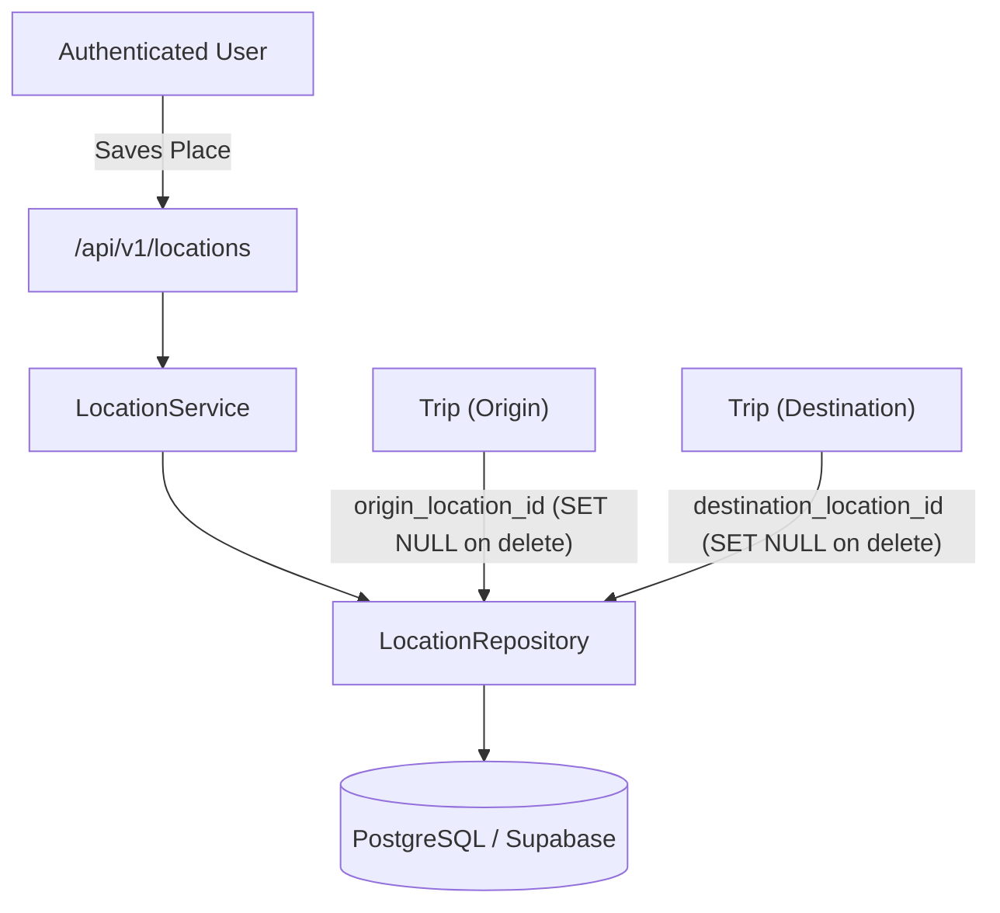

# 📍 Saved Locations & Geofencing Module (`locations`)

The **Locations Module** manages user-defined places (Home, Work, College, Food, Gym, etc.), coordinates (WGS84 Latitude/Longitude), and categorical tags. It integrates directly with map frameworks (Leaflet, Mapbox, Google Maps) and serves as the origin/destination anchor for journeys logged in the Trips Module.

---

## 📑 Table of Contents

1. [Architectural Overview & Coordinate Model](#-architectural-overview--coordinate-model)
2. [Database Schema & Foreign Keys](#-database-schema--foreign-keys)
3. [API Endpoints Reference](#-api-endpoints-reference)
4. [TypeScript Data Transfer Objects (DTOs)](#-typescript-data-transfer-objects-dtos)
5. [Frontend & Mobile Integration Guide](#-frontend--mobile-integration-guide)
   - [API Client Service (`locationsApi.ts`)](#1-api-client-service)
   - [React Query Hooks (`useLocations`, `useCreateLocation`, etc.)](#2-react-query-custom-hooks)
   - [UI Component: LocationCardGrid (Saved Places)](#3-ui-component-locationcardgrid)
   - [UI Component: Interactive Map Pin Picker (Leaflet / OpenStreetMap)](#4-ui-component-interactive-map-pin-picker)
6. [Validation Rules & Coordinate Precision](#-validation-rules--coordinate-precision)
7. [Error Handling Matrix](#-error-handling-matrix)
8. [Testing with cURL & Swagger](#-testing-with-curl--swagger)

---

## 🗺️ Architectural Overview & Coordinate Model



### Supported Location Categories:
- `home` — Primary residence / apartment
- `work` — Office / workplace / business
- `college` — University / school / campus
- `food` — Restaurant / cafe / grocery store
- `leisure` — Park / theater / entertainment
- `shopping` — Mall / market / retail center
- `health` — Hospital / clinic / gym / yoga center
- `other` — Generic or miscellaneous place

---

## 🗄️ Database Schema & Foreign Keys

### `locations` Table
| Column | Type | Constraints | Description |
| :--- | :--- | :--- | :--- |
| `id` | `VARCHAR(36)` | `PRIMARY KEY` | UUID v4 place identifier |
| `user_id` | `VARCHAR(36)` | `FK -> users.id (CASCADE), INDEX` | Account owner |
| `name` | `VARCHAR(100)` | `NOT NULL` | Place display label (e.g. "Home", "Central HQ") |
| `category` | `VARCHAR(20)` | `NOT NULL, DEFAULT 'other', INDEX` | Categorical tag |
| `latitude` | `DECIMAL(8,6)` | `NULLABLE, CHECK (-90..90)` | WGS84 Latitude (6 decimal places) |
| `longitude` | `DECIMAL(9,6)` | `NULLABLE, CHECK (-180..180)` | WGS84 Longitude (6 decimal places) |
| `notes` | `TEXT` | `NULLABLE` | Optional private place description |
| `created_at` | `TIMESTAMPTZ` | `NOT NULL` | Creation timestamp (UTC) |
| `updated_at` | `TIMESTAMPTZ` | `NOT NULL` | Last update timestamp (UTC) |

> 🔒 **Referential Integrity**: When a location is deleted, any trip referencing it has its `origin_location_id` or `destination_location_id` set to `NULL` (`ON DELETE SET NULL`). No trips are accidentally deleted!

---

## 📡 API Endpoints Reference

### Base URL: `/api/v1/locations`
All endpoints require `Authorization: Bearer <access_token>`

| Method | Endpoint | Query / Body | Description |
| :--- | :--- | :--- | :--- |
| `GET` | `/` | Query Filters | List user saved places with pagination and category filters |
| `POST` | `/` | `LocationCreate` JSON | Create and save a new location |
| `GET` | `/{location_id}` | Path UUID | Retrieve specific saved location details |
| `PATCH` | `/{location_id}` | `LocationUpdate` JSON | Modify attributes of a saved location |
| `DELETE` | `/{location_id}` | Path UUID | Permanently remove a saved place |

---

### 1. List Saved Locations
- **Route**: `GET /api/v1/locations`
- **Query Parameters**:
  - `page` (int, default `1`): Page number
  - `size` (int, default `20`, max `100`): Items per page
  - `category` (string, optional): Filter by category (`home`, `work`, `food`, etc.)
  - `search` (string, optional): Search keyword matching location name

- **Response `200 OK`**:
```json
{
  "items": [
    {
      "id": "3fa85f64-5717-4562-b3fc-2c963f66afa6",
      "name": "Central Residence",
      "category": "home",
      "latitude": "12.971598",
      "longitude": "77.594562",
      "notes": "Primary apartment near metro station",
      "created_at": "2026-08-01T00:00:00Z",
      "updated_at": "2026-08-01T00:00:00Z"
    },
    {
      "id": "4ba85f64-5717-4562-b3fc-2c963f66afa7",
      "name": "Tech Hub HQ",
      "category": "work",
      "latitude": "12.935242",
      "longitude": "77.624462",
      "notes": "4th floor workspace",
      "created_at": "2026-08-01T00:00:00Z",
      "updated_at": "2026-08-01T00:00:00Z"
    }
  ],
  "total": 7,
  "page": 1,
  "size": 20,
  "pages": 1
}
```

---

### 2. Create Saved Location
- **Route**: `POST /api/v1/locations`
- **Request Body**:
```json
{
  "name": "Downtown Fitness Center",
  "category": "health",
  "latitude": "12.978340",
  "longitude": "77.601230",
  "notes": "Open 24/7 with locker facility"
}
```
- **Response `201 Created`**: Returns created `LocationResponse`.

---

### 3. Update Saved Location
- **Route**: `PATCH /api/v1/locations/{location_id}`
- **Request Body**:
```json
{
  "name": "Downtown Fitness & Spa",
  "notes": "Updated locker code"
}
```
- **Response `200 OK`**: Returns updated `LocationResponse`.

---

### 4. Delete Saved Location
- **Route**: `DELETE /api/v1/locations/{location_id}`
- **Response `204 No Content`**

---

## 📐 TypeScript Data Transfer Objects (DTOs)

Add to `src/types/location.ts`:

```typescript
export type LocationCategory =
  | 'home'
  | 'work'
  | 'college'
  | 'food'
  | 'leisure'
  | 'shopping'
  | 'health'
  | 'other';

export interface LocationResponse {
  id: string;
  name: string;
  category: LocationCategory;
  latitude: string | null;  // Serialized decimal string e.g. "12.971598"
  longitude: string | null; // Serialized decimal string e.g. "77.594562"
  notes: string | null;
  created_at: string;
  updated_at: string;
}

export interface LocationCreate {
  name: string;
  category?: LocationCategory;
  latitude?: number | string | null;
  longitude?: number | string | null;
  notes?: string | null;
}

export interface LocationUpdate {
  name?: string;
  category?: LocationCategory;
  latitude?: number | string | null;
  longitude?: number | string | null;
  notes?: string | null;
}

export interface LocationQueryParams {
  page?: number;
  size?: number;
  category?: LocationCategory;
  search?: string;
}

export interface PaginatedLocationsResponse {
  items: LocationResponse[];
  total: number;
  page: number;
  size: number;
  pages: number;
}
```

---

## 💻 Frontend & Mobile Integration Guide

### 1. API Client Service
Create `src/api/locationsApi.ts`:

```typescript
import { apiClient } from './client';
import {
  LocationCreate,
  LocationUpdate,
  LocationResponse,
  LocationQueryParams,
  PaginatedLocationsResponse,
} from '../types/location';

export const locationsApi = {
  getLocations: async (params?: LocationQueryParams): Promise<PaginatedLocationsResponse> => {
    const { data } = await apiClient.get<PaginatedLocationsResponse>('/api/v1/locations', { params });
    return data;
  },

  getLocationById: async (locationId: string): Promise<LocationResponse> => {
    const { data } = await apiClient.get<LocationResponse>(`/api/v1/locations/${locationId}`);
    return data;
  },

  createLocation: async (payload: LocationCreate): Promise<LocationResponse> => {
    const { data } = await apiClient.post<LocationResponse>('/api/v1/locations', payload);
    return data;
  },

  updateLocation: async (locationId: string, payload: LocationUpdate): Promise<LocationResponse> => {
    const { data } = await apiClient.patch<LocationResponse>(`/api/v1/locations/${locationId}`, payload);
    return data;
  },

  deleteLocation: async (locationId: string): Promise<void> => {
    await apiClient.delete(`/api/v1/locations/${locationId}`);
  },
};
```

---

### 2. React Query Custom Hooks
Create `src/hooks/useLocations.ts`:

```typescript
import { useQuery, useMutation, useQueryClient } from '@tanstack/react-query';
import { locationsApi } from '../api/locationsApi';
import { LocationCreate, LocationQueryParams } from '../types/location';

export const useLocations = (params?: LocationQueryParams) => {
  return useQuery({
    queryKey: ['locations', params],
    queryFn: () => locationsApi.getLocations(params),
  });
};

export const useCreateLocation = () => {
  const queryClient = useQueryClient();
  return useMutation({
    mutationFn: (newLoc: LocationCreate) => locationsApi.createLocation(newLoc),
    onSuccess: () => {
      queryClient.invalidateQueries({ queryKey: ['locations'] });
    },
  });
};

export const useDeleteLocation = () => {
  const queryClient = useQueryClient();
  return useMutation({
    mutationFn: (locId: string) => locationsApi.deleteLocation(locId),
    onSuccess: () => {
      queryClient.invalidateQueries({ queryKey: ['locations'] });
      queryClient.invalidateQueries({ queryKey: ['trips'] });
    },
  });
};
```

---

### 3. UI Component: LocationCardGrid

```tsx
import React, { useState } from 'react';
import { useLocations, useDeleteLocation } from '../hooks/useLocations';
import { LocationCategory } from '../types/location';

const CATEGORY_ICONS: Record<LocationCategory, string> = {
  home: '🏠',
  work: '💼',
  college: '🎓',
  food: '🍕',
  leisure: '🌳',
  shopping: '🛍️',
  health: '🏥',
  other: '📍',
};

export const LocationCardGrid: React.FC = () => {
  const [category, setCategory] = useState<LocationCategory | ''>('');
  const { data, isLoading } = useLocations({ category: category || undefined });
  const deleteMutation = useDeleteLocation();

  if (isLoading) return <div>Loading saved places...</div>;

  return (
    <div style={{ padding: 16 }}>
      <div style={{ display: 'flex', justifyContent: 'space-between', alignItems: 'center', marginBottom: 20 }}>
        <h2>Saved Locations ({data?.total || 0})</h2>
        <select value={category} onChange={(e) => setCategory(e.target.value as any)}>
          <option value="">All Categories</option>
          <option value="home">Home</option>
          <option value="work">Work</option>
          <option value="health">Health / Gym</option>
          <option value="food">Food & Dining</option>
          <option value="shopping">Shopping</option>
        </select>
      </div>

      <div style={{ display: 'grid', gridTemplateColumns: 'repeat(auto-fill, minmax(280px, 1fr))', gap: 16 }}>
        {data?.items.map((loc) => (
          <div key={loc.id} style={{ border: '1px solid #e2e8f0', borderRadius: 8, padding: 16, background: '#ffffff', position: 'relative' }}>
            <div style={{ fontSize: 24, marginBottom: 8 }}>{CATEGORY_ICONS[loc.category]}</div>
            <h4 style={{ margin: '0 0 4px 0' }}>{loc.name}</h4>
            <span style={{ fontSize: 12, textTransform: 'uppercase', background: '#f1f5f9', padding: '2px 8px', borderRadius: 4 }}>
              {loc.category}
            </span>

            {loc.latitude && loc.longitude && (
              <div style={{ fontSize: 13, color: '#64748b', marginTop: 8 }}>
                📍 {loc.latitude}, {loc.longitude}
              </div>
            )}

            {loc.notes && <p style={{ fontSize: 13, color: '#475569', marginTop: 8 }}>{loc.notes}</p>}

            <button
              onClick={() => deleteMutation.mutate(loc.id)}
              style={{ marginTop: 12, color: '#ef4444', background: 'transparent', border: 'none', cursor: 'pointer', fontSize: 13 }}
            >
              Remove Place
            </button>
          </div>
        ))}
      </div>
    </div>
  );
};
```

---

### 4. UI Component: Interactive Map Pin Picker
Example integration using OpenStreetMap & Leaflet (`react-leaflet`):

```tsx
import React, { useState } from 'react';
import { MapContainer, TileLayer, Marker, useMapEvents } from 'react-leaflet';
import 'leaflet/dist/leaflet.css';

interface Props {
  onLocationSelected: (lat: number, lng: number) => void;
}

const LocationMarker: React.FC<{ onSelect: (lat: number, lng: number) => void }> = ({ onSelect }) => {
  const [position, setPosition] = useState<{ lat: number; lng: number } | null>(null);

  useMapEvents({
    click(e) {
      setPosition(e.latlng);
      onSelect(e.latlng.lat, e.latlng.lng);
    },
  });

  return position === null ? null : <Marker position={position} />;
};

export const MapPinPicker: React.FC<Props> = ({ onLocationSelected }) => {
  return (
    <div style={{ height: 300, width: '100%', borderRadius: 8, overflow: 'hidden' }}>
      <MapContainer center={[12.9716, 77.5946]} zoom={12} style={{ height: '100%', width: '100%' }}>
        <TileLayer
          attribution='&copy; <a href="https://www.openstreetmap.org/copyright">OpenStreetMap</a>'
          url="https://{s}.tile.openstreetmap.org/{z}/{x}/{y}.png"
        />
        <LocationMarker onSelect={onLocationSelected} />
      </MapContainer>
    </div>
  );
};
```

---

## 🔒 Validation Rules & Coordinate Precision

| Field | Validation Constraint | Error Response |
| :--- | :--- | :--- |
| `name` | 1 to 100 characters | `"String should have at least 1 character"` |
| `category` | Must be one of the 8 `LocationCategory` enums | `"Input should be 'home', 'work', 'college'..."` |
| `latitude` | Decimal between `-90.000000` and `+90.000000` | `"Input should be greater than or equal to -90"` |
| `longitude`| Decimal between `-180.000000` and `+180.000000`| `"Input should be greater than or equal to -180"` |
| **Paired Coordinates Rule** | Both `latitude` and `longitude` must be provided, or both omitted | `"latitude and longitude must be supplied together"` |

---

## ⚠️ Error Handling Matrix

| HTTP Status | Trigger Reason | Response `detail` Example |
| :--- | :--- | :--- |
| `401 Unauthorized` | Missing or invalid Bearer token | `"Could not validate credentials"` |
| `404 Not Found` | Location ID not found or belongs to another user | `"Location not found"` |
| `422 Unprocessable`| Supplying `latitude` without `longitude` (or vice-versa) | `[{"loc": ["body"], "msg": "Value error, latitude and longitude must be supplied together"}]` |

---

## 🧪 Testing with cURL & Swagger

### 1. Create a Saved Place with cURL
```bash
curl -X POST "https://citypulse-api-tjpr.onrender.com/api/v1/locations" \
     -H "Authorization: Bearer <YOUR_ACCESS_TOKEN>" \
     -H "Content-Type: application/json" \
     -d '{
       "name": "Central Residence",
       "category": "home",
       "latitude": "12.971598",
       "longitude": "77.594562",
       "notes": "Primary apartment"
     }'
```

### 2. List All Saved Places with cURL
```bash
curl -X GET "https://citypulse-api-tjpr.onrender.com/api/v1/locations" \
     -H "Authorization: Bearer <YOUR_ACCESS_TOKEN>"
```
