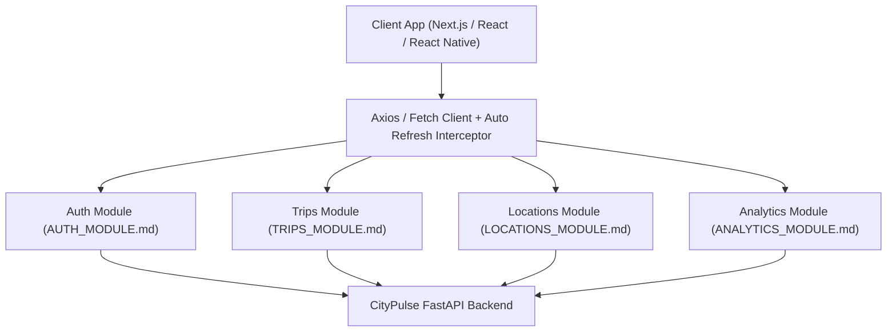

# 🌐 CityPulse — Full-Stack Module Integration Architecture

Welcome to the **CityPulse API Full-Stack Module Reference**. This documentation suite provides frontend, mobile, and backend engineers with complete module-by-module integration guides, TypeScript interfaces, ready-to-use API clients, React/React Native hooks, UI component blueprints, validation schemas, and cURL/Swagger testing recipes.

---

## 📚 Module Documentation Index

| Module | Core Purpose | Live Endpoints | Documentation Guide |
| :--- | :--- | :--- | :--- |
| 🔐 **Authentication & Users** | Argon2id Auth, JWT Refresh Tokens, Session Management, User Profiles | `/api/v1/auth/*` | [👉 Read AUTH_MODULE.md](AUTH_MODULE.md) |
| 🚗 **Trips & Mobility Tracking** | Spatio-Temporal Journey Logging, Transport Modes, Distance, Cost, Ratings | `/api/v1/trips/*` | [👉 Read TRIPS_MODULE.md](TRIPS_MODULE.md) |
| 📍 **Saved Locations & Places** | User Places (Home, Work, etc.), Paired Coordinates (WGS84 Lat/Lng), Categories | `/api/v1/locations/*` | [👉 Read LOCATIONS_MODULE.md](LOCATIONS_MODULE.md) |
| 📊 **Analytics & Anomaly Detection** | Aggregated KPIs, Mode Distribution, Time-Series Charts, Statistical Outlier Detection | `/api/v1/analytics/*` | [👉 Read ANALYTICS_MODULE.md](ANALYTICS_MODULE.md) |

---

## 🌐 API Environment Endpoints

| Environment | Base URL | OpenAPI Specification | Interactive Swagger Docs |
| :--- | :--- | :--- | :--- |
| **Production (Render Live)** | `https://citypulse-api-tjpr.onrender.com` | `https://citypulse-api-tjpr.onrender.com/api/v1/openapi.json` | [Render Swagger UI](https://citypulse-api-tjpr.onrender.com/api/v1/docs) |
| **Local Development** | `http://127.0.0.1:8000` | `http://127.0.0.1:8000/api/v1/openapi.json` | [Local Swagger UI](http://127.0.0.1:8000/api/v1/docs) |

> 💡 **CORS Policy**: The backend allows all origins (`*`) and supports standard HTTP headers (`Authorization`, `Content-Type`, `Accept`). No reverse proxy or CORS bypass is needed in local or web environments.

---

## 🔑 Pre-Seeded Sandbox Accounts

Use these pre-loaded accounts to test full data sets across all 4 modules without needing to manually generate trips or locations:

| Account | Email | Password | Data Volume |
| :--- | :--- | :--- | :--- |
| **Alice Urban (Primary)** | `alice_urban@example.com` | `StrongPassword!2026` | 26 Trips, 7 Locations, Metro/Car/Bike analytics |
| **Bob Commuter** | `bob_commuter@example.com` | `StrongPassword!2026` | 28 Trips, 6 Locations, Train/Bus daily commutes |
| **Carol Cyclist** | `carol_cyclist@example.com` | `StrongPassword!2026` | 24 Trips, 5 Locations, High-frequency bike journeys |
| **David Transit** | `david_transit@example.com` | `StrongPassword!2026` | 26 Trips, 6 Locations, Multi-modal transit routes |
| **Eva Walker** | `eva_walker@example.com` | `StrongPassword!2026` | 26 Trips, 7 Locations, Walk & micro-mobility trips |

---

## 📐 Universal Response Envelope & Pagination Contract

### 1. Paginated Collection Schema (`PaginatedResponse<T>`)
Every multi-record endpoint (`GET /api/v1/trips`, `GET /api/v1/locations`) uses a standard envelope:

```typescript
export interface PaginatedResponse<T> {
  items: T[];
  total: number;
  page: number;
  size: number;
  pages: number;
}
```

#### JSON Structure:
```json
{
  "items": [ /* array of records */ ],
  "total": 142,
  "page": 1,
  "size": 20,
  "pages": 8
}
```

### 2. Standard Error Envelope (`HTTPValidationError` / `ErrorResponse`)
All 4xx and 5xx errors adhere to standard schemas:

```typescript
// Validation Error (422 Unprocessable Entity)
export interface ValidationErrorDetail {
  loc: (string | number)[];
  msg: string;
  type: string;
}

export interface HTTPValidationError {
  detail: ValidationErrorDetail[];
}

// Business Exception (400, 401, 403, 404, 409, 429)
export interface APIErrorResponse {
  detail: string;
}
```

---

## 🛠️ Shared Full-Stack Architecture Recommendations



### Key Integration Practices:
1. **Central Axios Client with Token Queue**: Manage JWT token refresh seamlessly using a request/response interceptor to avoid concurrent 401 token refresh collisions.
2. **Strict Timezone Handling**: All trip timestamps (`started_at`, `ended_at`) must be transmitted with explicit timezone offsets (e.g. `2026-08-14T08:30:00+05:30` or `Z`).
3. **Paired Coordinates Validation**: Whenever providing coordinates for locations, both `latitude` and `longitude` must be provided together or both omitted.
4. **Optimistic Updates & Query Invalidation**: When creating or updating a trip or location, invalidate the React Query keys `['trips']`, `['locations']`, and `['analytics']` to trigger automatic dashboard re-renders.

---

Navigate to any module guide below to start integrating:
- [🔐 AUTH_MODULE.md](AUTH_MODULE.md)
- [🚗 TRIPS_MODULE.md](TRIPS_MODULE.md)
- [📍 LOCATIONS_MODULE.md](LOCATIONS_MODULE.md)
- [📊 ANALYTICS_MODULE.md](ANALYTICS_MODULE.md)
