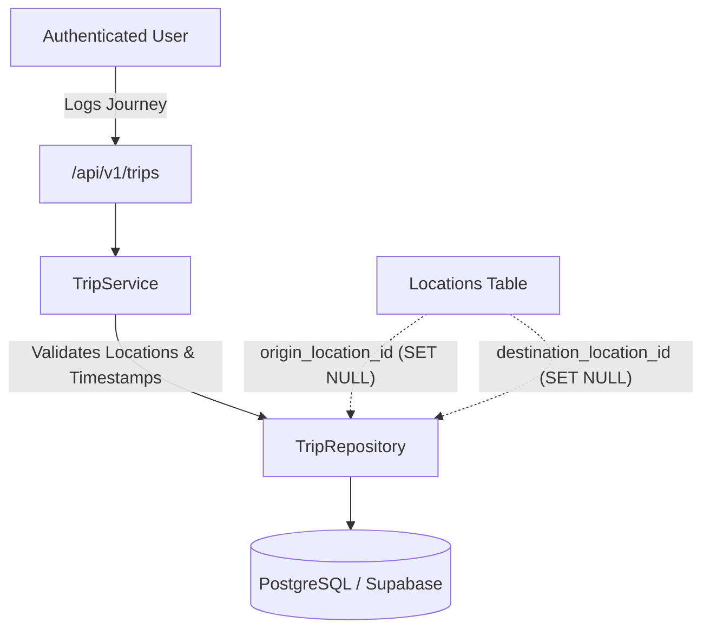

# 🚗 Trips & Mobility Journey Tracking Module (`trips`)

The **Trips Module** is the core mobility logging engine of CityPulse. It handles spatio-temporal journey tracking, transit mode classification, multi-parameter filtering, duration and cost calculations, rating feedback, and location associations.

---

## 📑 Table of Contents

1. [Architectural Overview & Data Constraints](#-architectural-overview--data-constraints)
2. [Database Schema & Relationships](#-database-schema--relationships)
3. [API Endpoints Reference](#-api-endpoints-reference)
4. [TypeScript Data Transfer Objects (DTOs)](#-typescript-data-transfer-objects-dtos)
5. [Frontend & Mobile Integration Guide](#-frontend--mobile-integration-guide)
   - [API Client Service (`tripsApi.ts`)](#1-api-client-service)
   - [React Query Hooks (`useTrips`, `useCreateTrip`, etc.)](#2-react-query-custom-hooks)
   - [UI Component: TripLogModal (Form with Validation)](#3-ui-component-triplogmodal)
   - [UI Component: TripDataTable (Paginated & Filtered Grid)](#4-ui-component-tripdatatable)
6. [Validation Rules & Timezone Handling](#-validation-rules--timezone-handling)
7. [Error Handling Matrix](#-error-handling-matrix)
8. [Testing with cURL & Swagger](#-testing-with-curl--swagger)

---

## 🧭 Architectural Overview & Data Constraints



### Supported Transportation Modes:
The system supports 9 standardized transit modes:
- `walk` — Walking & pedestrian transit
- `bike` — Bicycle / e-bike / micro-mobility
- `bus` — City bus / shuttle transit
- `train` — Regional rail / commuter train
- `metro` — Subway / rapid metro transit
- `car` — Personal automobile
- `auto` — Auto rickshaw / tuk-tuk
- `ride_share` — Uber / Lyft / Grab / Ola
- `other` — Ferry, scooter, flights, etc.

---

## 🗄️ Database Schema & Relationships

### `trips` Table
| Column | Type | Constraints | Description |
| :--- | :--- | :--- | :--- |
| `id` | `VARCHAR(36)` | `PRIMARY KEY` | UUID v4 journey identifier |
| `user_id` | `VARCHAR(36)` | `FK -> users.id (CASCADE), INDEX` | Account owner |
| `origin_location_id` | `VARCHAR(36)` | `FK -> locations.id (SET NULL)` | Optional starting place |
| `destination_location_id` | `VARCHAR(36)` | `FK -> locations.id (SET NULL)` | Optional arrival place |
| `transport_mode` | `VARCHAR(20)` | `NOT NULL, INDEX` | Enum of 9 transport modes |
| `started_at` | `TIMESTAMPTZ` | `NOT NULL, INDEX` | Trip departure timestamp with timezone |
| `ended_at` | `TIMESTAMPTZ` | `NOT NULL` | Trip arrival timestamp with timezone |
| `distance_km` | `DECIMAL(8,2)` | `NOT NULL, CHECK (>= 0)` | Total distance traveled in kilometers |
| `cost` | `DECIMAL(10,2)` | `NOT NULL, DEFAULT 0.00, CHECK (>= 0)` | Monetary expenditure (fare, fuel, toll) |
| `rating` | `INTEGER` | `NULLABLE, CHECK (1..5)` | Personal experience rating (1 to 5 stars) |
| `purpose` | `VARCHAR(100)` | `NULLABLE` | Short journey purpose (e.g. Work, Gym, Leisure) |
| `notes` | `TEXT` | `NULLABLE` | Detailed private trip notes |
| `created_at` | `TIMESTAMPTZ` | `NOT NULL` | UTC creation timestamp |
| `updated_at` | `TIMESTAMPTZ` | `NOT NULL` | UTC last modification timestamp |

---

## 📡 API Endpoints Reference

### Base URL: `/api/v1/trips`
All endpoints require `Authorization: Bearer <access_token>`

| Method | Endpoint | Query / Body | Description |
| :--- | :--- | :--- | :--- |
| `GET` | `/` | Query Filters | List journeys with pagination, mode filters, and date ranges |
| `POST` | `/` | `TripCreate` JSON | Log a new mobility journey |
| `GET` | `/{trip_id}` | Path UUID | Retrieve full details of a specific trip |
| `PATCH` | `/{trip_id}` | `TripUpdate` JSON | Modify attributes of an existing trip |
| `DELETE` | `/{trip_id}` | Path UUID | Permanently delete a recorded trip |

---

### 1. List Trips (Filtered & Paginated)
- **Route**: `GET /api/v1/trips`
- **Query Parameters**:
  - `page` (int, default `1`): Page number
  - `size` (int, default `20`, max `100`): Items per page
  - `transport_mode` (string, optional): Filter by mode (`walk`, `bike`, `bus`, `metro`, etc.)
  - `from_date` (ISO date, optional): Filter journeys starting on or after `YYYY-MM-DD`
  - `to_date` (ISO date, optional): Filter journeys starting on or before `YYYY-MM-DD`
  - `min_distance_km` (float, optional): Filter by minimum distance
  - `max_distance_km` (float, optional): Filter by maximum distance
  - `sort_by` (string, default `started_at`): Sort field (`started_at`, `distance_km`, `cost`, `created_at`)
  - `sort_dir` (string, default `desc`): Sort direction (`asc` or `desc`)

- **Response `200 OK`**:
```json
{
  "items": [
    {
      "id": "7fa85f64-5717-4562-b3fc-2c963f66afa9",
      "origin_location_id": "3fa85f64-5717-4562-b3fc-2c963f66afa6",
      "destination_location_id": "4ba85f64-5717-4562-b3fc-2c963f66afa7",
      "transport_mode": "metro",
      "started_at": "2026-08-14T08:30:00Z",
      "ended_at": "2026-08-14T09:15:00Z",
      "distance_km": "14.50",
      "cost": "45.00",
      "rating": 5,
      "purpose": "Morning commute to office",
      "notes": "Smooth journey with minimal crowd",
      "created_at": "2026-08-14T09:16:00Z",
      "updated_at": "2026-08-14T09:16:00Z"
    }
  ],
  "total": 26,
  "page": 1,
  "size": 20,
  "pages": 2
}
```

---

### 2. Create a New Trip
- **Route**: `POST /api/v1/trips`
- **Request Body**:
```json
{
  "origin_location_id": "3fa85f64-5717-4562-b3fc-2c963f66afa6",
  "destination_location_id": "4ba85f64-5717-4562-b3fc-2c963f66afa7",
  "transport_mode": "metro",
  "started_at": "2026-08-14T08:30:00+05:30",
  "ended_at": "2026-08-14T09:15:00+05:30",
  "distance_km": "14.50",
  "cost": "45.00",
  "rating": 5,
  "purpose": "Morning commute to office",
  "notes": "Smooth journey with minimal crowd"
}
```
- **Response `201 Created`**: Returns the complete created `TripResponse` object.

---

### 3. Update an Existing Trip
- **Route**: `PATCH /api/v1/trips/{trip_id}`
- **Request Body** (All fields optional):
```json
{
  "rating": 4,
  "cost": "50.00",
  "notes": "Updated fare receipt"
}
```
- **Response `200 OK`**: Returns updated `TripResponse`.

---

### 4. Delete a Trip
- **Route**: `DELETE /api/v1/trips/{trip_id}`
- **Response `204 No Content`**

---

## 📐 TypeScript Data Transfer Objects (DTOs)

Add to `src/types/trip.ts`:

```typescript
export type TransportMode =
  | 'walk'
  | 'bike'
  | 'bus'
  | 'train'
  | 'metro'
  | 'car'
  | 'auto'
  | 'ride_share'
  | 'other';

export interface TripResponse {
  id: string;
  origin_location_id: string | null;
  destination_location_id: string | null;
  transport_mode: TransportMode;
  started_at: string;
  ended_at: string;
  distance_km: string; // Serialized decimal e.g. "14.50"
  cost: string;        // Serialized decimal e.g. "45.00"
  rating: number | null;
  purpose: string | null;
  notes: string | null;
  created_at: string;
  updated_at: string;
}

export interface TripCreate {
  origin_location_id?: string | null;
  destination_location_id?: string | null;
  transport_mode: TransportMode;
  started_at: string; // ISO 8601 with offset e.g. "2026-08-14T08:30:00+05:30"
  ended_at: string;   // ISO 8601 with offset
  distance_km: number | string;
  cost?: number | string;
  rating?: number | null;
  purpose?: string | null;
  notes?: string | null;
}

export interface TripUpdate {
  origin_location_id?: string | null;
  destination_location_id?: string | null;
  transport_mode?: TransportMode;
  started_at?: string;
  ended_at?: string;
  distance_km?: number | string;
  cost?: number | string;
  rating?: number | null;
  purpose?: string | null;
  notes?: string | null;
}

export interface TripQueryParams {
  page?: number;
  size?: number;
  transport_mode?: TransportMode;
  from_date?: string; // YYYY-MM-DD
  to_date?: string;   // YYYY-MM-DD
  min_distance_km?: number;
  max_distance_km?: number;
  origin_location_id?: string;
  destination_location_id?: string;
  sort_by?: 'started_at' | 'distance_km' | 'cost' | 'created_at';
  sort_dir?: 'asc' | 'desc';
}

export interface PaginatedTripsResponse {
  items: TripResponse[];
  total: number;
  page: number;
  size: number;
  pages: number;
}
```

---

## 💻 Frontend & Mobile Integration Guide

### 1. API Client Service
Create `src/api/tripsApi.ts`:

```typescript
import { apiClient } from './client';
import {
  TripCreate,
  TripUpdate,
  TripResponse,
  TripQueryParams,
  PaginatedTripsResponse,
} from '../types/trip';

export const tripsApi = {
  getTrips: async (params?: TripQueryParams): Promise<PaginatedTripsResponse> => {
    const { data } = await apiClient.get<PaginatedTripsResponse>('/api/v1/trips', { params });
    return data;
  },

  getTripById: async (tripId: string): Promise<TripResponse> => {
    const { data } = await apiClient.get<TripResponse>(`/api/v1/trips/${tripId}`);
    return data;
  },

  createTrip: async (payload: TripCreate): Promise<TripResponse> => {
    const { data } = await apiClient.post<TripResponse>('/api/v1/trips', payload);
    return data;
  },

  updateTrip: async (tripId: string, payload: TripUpdate): Promise<TripResponse> => {
    const { data } = await apiClient.patch<TripResponse>(`/api/v1/trips/${tripId}`, payload);
    return data;
  },

  deleteTrip: async (tripId: string): Promise<void> => {
    await apiClient.delete(`/api/v1/trips/${tripId}`);
  },
};
```

---

### 2. React Query Custom Hooks
Create `src/hooks/useTrips.ts`:

```typescript
import { useQuery, useMutation, useQueryClient } from '@tanstack/react-query';
import { tripsApi } from '../api/tripsApi';
import { TripCreate, TripUpdate, TripQueryParams } from '../types/trip';

export const useTrips = (params?: TripQueryParams) => {
  return useQuery({
    queryKey: ['trips', params],
    queryFn: () => tripsApi.getTrips(params),
    keepPreviousData: true,
  });
};

export const useCreateTrip = () => {
  const queryClient = useQueryClient();
  return useMutation({
    mutationFn: (newTrip: TripCreate) => tripsApi.createTrip(newTrip),
    onSuccess: () => {
      queryClient.invalidateQueries({ queryKey: ['trips'] });
      queryClient.invalidateQueries({ queryKey: ['analytics'] });
    },
  });
};

export const useDeleteTrip = () => {
  const queryClient = useQueryClient();
  return useMutation({
    mutationFn: (tripId: string) => tripsApi.deleteTrip(tripId),
    onSuccess: () => {
      queryClient.invalidateQueries({ queryKey: ['trips'] });
      queryClient.invalidateQueries({ queryKey: ['analytics'] });
    },
  });
};
```

---

### 3. UI Component: TripLogModal

```tsx
import React, { useState } from 'react';
import { useCreateTrip } from '../hooks/useTrips';
import { TransportMode } from '../types/trip';

interface Props {
  isOpen: boolean;
  onClose: () => void;
}

export const TripLogModal: React.FC<Props> = ({ isOpen, onClose }) => {
  const createTripMutation = useCreateTrip();
  const [mode, setMode] = useState<TransportMode>('metro');
  const [startedAt, setStartedAt] = useState('');
  const [endedAt, setEndedAt] = useState('');
  const [distanceKm, setDistanceKm] = useState('');
  const [cost, setCost] = useState('0.00');
  const [purpose, setPurpose] = useState('');
  const [rating, setRating] = useState<number | ''>(5);
  const [error, setError] = useState<string | null>(null);

  if (!isOpen) return null;

  const handleSubmit = async (e: React.FormEvent) => {
    e.preventDefault();
    setError(null);

    // Format local datetime to ISO with timezone
    const startIso = new Date(startedAt).toISOString();
    const endIso = new Date(endedAt).toISOString();

    if (new Date(endIso) <= new Date(startIso)) {
      setError('Arrival time must be after departure time.');
      return;
    }

    try {
      await createTripMutation.mutateAsync({
        transport_mode: mode,
        started_at: startIso,
        ended_at: endIso,
        distance_km: distanceKm,
        cost: cost || '0',
        purpose: purpose || undefined,
        rating: rating === '' ? undefined : Number(rating),
      });
      onClose();
    } catch (err: any) {
      setError(err.response?.data?.detail || 'Failed to log trip.');
    }
  };

  return (
    <div style={{ position: 'fixed', inset: 0, backgroundColor: 'rgba(0,0,0,0.5)', display: 'flex', alignItems: 'center', justifyContent: 'center' }}>
      <div style={{ background: '#fff', padding: 24, borderRadius: 8, width: 450, maxWidth: '90%' }}>
        <h3>Log Mobility Trip</h3>
        {error && <div style={{ color: '#ef4444', marginBottom: 12 }}>{error}</div>}
        <form onSubmit={handleSubmit}>
          <label>Transport Mode</label>
          <select value={mode} onChange={(e) => setMode(e.target.value as TransportMode)} style={{ width: '100%', marginBottom: 12 }}>
            <option value="walk">🚶 Walk</option>
            <option value="bike">🚲 Bike</option>
            <option value="bus">🚌 Bus</option>
            <option value="metro">🚇 Metro</option>
            <option value="train">🚆 Train</option>
            <option value="car">🚗 Car</option>
            <option value="auto">🛺 Auto Rickshaw</option>
            <option value="ride_share">🚕 Ride Share</option>
          </select>

          <label>Departure Time</label>
          <input type="datetime-local" required value={startedAt} onChange={(e) => setStartedAt(e.target.value)} style={{ width: '100%', marginBottom: 12 }} />

          <label>Arrival Time</label>
          <input type="datetime-local" required value={endedAt} onChange={(e) => setEndedAt(e.target.value)} style={{ width: '100%', marginBottom: 12 }} />

          <label>Distance (km)</label>
          <input type="number" step="0.01" required min="0.01" value={distanceKm} onChange={(e) => setDistanceKm(e.target.value)} style={{ width: '100%', marginBottom: 12 }} />

          <label>Cost</label>
          <input type="number" step="0.01" min="0" value={cost} onChange={(e) => setCost(e.target.value)} style={{ width: '100%', marginBottom: 12 }} />

          <label>Rating (1-5)</label>
          <input type="number" min="1" max="5" value={rating} onChange={(e) => setRating(e.target.value ? Number(e.target.value) : '')} style={{ width: '100%', marginBottom: 16 }} />

          <div style={{ display: 'flex', justifyContent: 'flex-end', gap: 8 }}>
            <button type="button" onClick={onClose}>Cancel</button>
            <button type="submit" style={{ background: '#0284c7', color: '#fff' }}>Save Journey</button>
          </div>
        </form>
      </div>
    </div>
  );
};
```

---

### 4. UI Component: TripDataTable

```tsx
import React, { useState } from 'react';
import { useTrips, useDeleteTrip } from '../hooks/useTrips';
import { TransportMode } from '../types/trip';

export const TripDataTable: React.FC = () => {
  const [page, setPage] = useState(1);
  const [modeFilter, setModeFilter] = useState<TransportMode | ''>('');
  const { data, isLoading } = useTrips({ page, size: 10, transport_mode: modeFilter || undefined });
  const deleteMutation = useDeleteTrip();

  if (isLoading) return <div>Loading mobility journeys...</div>;

  return (
    <div style={{ padding: 16 }}>
      <div style={{ display: 'flex', justifyContent: 'space-between', marginBottom: 16 }}>
        <h2>My Recorded Trips ({data?.total || 0})</h2>
        <select value={modeFilter} onChange={(e) => { setModeFilter(e.target.value as any); setPage(1); }}>
          <option value="">All Transport Modes</option>
          <option value="walk">Walk</option>
          <option value="bike">Bike</option>
          <option value="metro">Metro</option>
          <option value="bus">Bus</option>
          <option value="car">Car</option>
        </select>
      </div>

      <table style={{ width: '100%', borderCollapse: 'collapse' }}>
        <thead>
          <tr style={{ background: '#f1f5f9', textAlign: 'left' }}>
            <th style={{ padding: 8 }}>Mode</th>
            <th style={{ padding: 8 }}>Date / Time</th>
            <th style={{ padding: 8 }}>Distance</th>
            <th style={{ padding: 8 }}>Cost</th>
            <th style={{ padding: 8 }}>Rating</th>
            <th style={{ padding: 8 }}>Actions</th>
          </tr>
        </thead>
        <tbody>
          {data?.items.map((trip) => (
            <tr key={trip.id} style={{ borderBottom: '1px solid #e2e8f0' }}>
              <td style={{ padding: 8 }}><b>{trip.transport_mode.toUpperCase()}</b></td>
              <td style={{ padding: 8 }}>{new Date(trip.started_at).toLocaleString()}</td>
              <td style={{ padding: 8 }}>{trip.distance_km} km</td>
              <td style={{ padding: 8 }}>${trip.cost}</td>
              <td style={{ padding: 8 }}>{trip.rating ? '⭐'.repeat(trip.rating) : '-'}</td>
              <td style={{ padding: 8 }}>
                <button
                  onClick={() => deleteMutation.mutate(trip.id)}
                  style={{ color: '#ef4444', border: 'none', background: 'transparent', cursor: 'pointer' }}
                >
                  Delete
                </button>
              </td>
            </tr>
          ))}
        </tbody>
      </table>

      {/* Pagination controls */}
      <div style={{ marginTop: 16, display: 'flex', gap: 8, alignItems: 'center' }}>
        <button disabled={page <= 1} onClick={() => setPage((p) => p - 1)}>Previous</button>
        <span>Page {data?.page} of {data?.pages || 1}</span>
        <button disabled={page >= (data?.pages || 1)} onClick={() => setPage((p) => p + 1)}>Next</button>
      </div>
    </div>
  );
};
```

---

## 🔒 Validation Rules & Timezone Handling

| Field | Validation Constraint | Error Response |
| :--- | :--- | :--- |
| `started_at` | Valid ISO 8601 string **with timezone offset** | `"must include a timezone, for example 2026-08-14T08:30:00+05:30"` |
| `ended_at` | Valid ISO 8601 string, must be chronologically **after `started_at`** | `"ended_at must be after started_at"` |
| `distance_km`| Decimal between `0.00` and `50,000.00` | `"Input should be greater than or equal to 0"` |
| `cost` | Decimal between `0.00` and `1,000,000.00` | `"Input should be greater than or equal to 0"` |
| `rating` | Optional integer between `1` and `5` | `"Input should be between 1 and 5"` |
| `origin_location_id` | 36-char UUID, must belong to authenticated user | `"Origin location not found or not owned by user"` |

---

## ⚠️ Error Handling Matrix

| HTTP Status | Trigger Reason | Response `detail` Example |
| :--- | :--- | :--- |
| `401 Unauthorized` | Missing, expired, or invalid Bearer JWT | `"Could not validate credentials"` |
| `404 Not Found` | Trip ID does not exist or belongs to another user | `"Trip not found"` |
| `404 Not Found` | Location foreign key ID does not exist | `"Origin location not found"` |
| `422 Unprocessable`| Missing timezone or `ended_at <= started_at` | `[{"loc": ["body", "ended_at"], "msg": "ended_at must be after started_at"}]` |

---

## 🧪 Testing with cURL & Swagger

### 1. Create a Trip with cURL
```bash
curl -X POST "https://citypulse-api-tjpr.onrender.com/api/v1/trips" \
     -H "Authorization: Bearer <YOUR_ACCESS_TOKEN>" \
     -H "Content-Type: application/json" \
     -d '{
       "transport_mode": "metro",
       "started_at": "2026-08-14T08:30:00Z",
       "ended_at": "2026-08-14T09:15:00Z",
       "distance_km": "14.50",
       "cost": "45.00",
       "rating": 5,
       "purpose": "Commute"
     }'
```

### 2. Query Filtered Trips with cURL
```bash
curl -X GET "https://citypulse-api-tjpr.onrender.com/api/v1/trips?transport_mode=metro&page=1&size=10" \
     -H "Authorization: Bearer <YOUR_ACCESS_TOKEN>"
```
